# Java Network Programming

> This is a Java course to understand java network programming with blocking and non-blocking IO.

Tools used:

- JDK 11
- Maven
- JUnit 5, Mockito
- IntelliJ IDE

## Table of contents

1. [Introduction to Networking](https://github.com/backstreetbrogrammer/42_JavaNetworkProgramming#chapter-01-introduction-to-networking)
    - [TCP/IP model](https://github.com/backstreetbrogrammer/42_JavaNetworkProgramming#tcpip-model)
2. [HTTP Basics](https://github.com/backstreetbrogrammer/42_JavaNetworkProgramming#chapter-02-http-basics)
    - [Interview Problem 1 (JP Morgan Chase): What is HTTPS and how is it different from HTTP?](https://github.com/backstreetbrogrammer/42_JavaNetworkProgramming#interview-problem-1-jp-morgan-chase-what-is-https-and-how-is-it-different-from-http)
    - [HTTP Server](https://github.com/backstreetbrogrammer/42_JavaNetworkProgramming#http-server)
    - HTTP Client
3. Blocking Server
    - Single-Threaded
    - Multi-Threaded
    - ExecutorService
    - Java NIO
4. Non-Blocking Server
    - Polling
    - Selector

---

## Chapter 01. Introduction to Networking

A communication protocol is a system of rules that allows two or more entities of a communications system to
transmit information via any variation of a physical quantity.

The protocol defines the rules, syntax, semantics, and synchronization of communication and possible error recovery
methods. Protocols may be implemented by hardware, software, or a combination of both.

The information exchanged between devices through a network or other media is governed by rules and conventions that can
be set out in communication protocol specifications.

These specifications, define the nature of communication, the actual data exchanged and any state-dependent behaviors.

In digital computing systems, the rules can be expressed by algorithms and data structures.

**Protocols** are to **communication** what **algorithms** or programming languages are to **computations**.

To implement a **networking protocol**, the protocol software modules are interfaced with a framework implemented on the
machine's operating system. This framework implements the networking functionality of the operating system.

When protocol algorithms are expressed in a portable programming language, the protocol software may be made operating
system independent. The best-known frameworks are the **TCP/IP model** and the **OSI model**.

**Types of communication protocols**

There are **two** types of communication protocols, based on their representation of the content being carried:

- **Text-based**: A text-based protocol or plain text protocol represents its content in human-readable format,
  often in plain text encoded in a machine-readable encoding such as `ASCII` or `UTF-8`, or in structured text-based
  formats such as `XML` or `JSON`.
  Examples: **FTP**, **SMTP**, **HTTP** (earlier versions), **Finger Protocol**

- **Binary**: A binary protocol utilizes all values of a `byte`, as opposed to a text-based protocol which only uses
  values corresponding to human-readable characters in `ASCII` encoding. Binary protocols are intended to be read by a
  machine rather than a human being. Binary protocols have the advantage of terseness, which translates into speed of
  transmission and interpretation.
  Examples: **HTTP/2**, **HTTP/3**, **EbXML**, **EDOC**

### TCP/IP model

The Internet protocol suite, commonly known as TCP/IP, is a framework for organizing the set of communication protocols
used in the Internet and similar computer networks according to functional criteria.

The foundational protocols in the suite are:

- Transmission Control Protocol (TCP)
- User Datagram Protocol (UDP)
- Internet Protocol (IP)

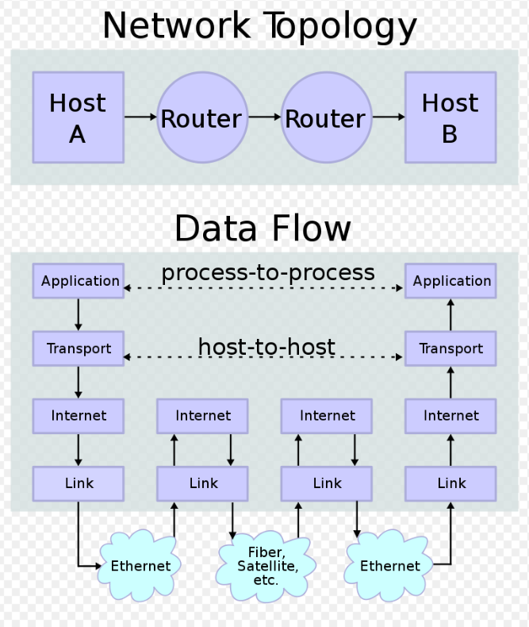

Conceptual data flow in a simple network topology of two hosts (A and B) connected by a link between their respective
routers.

The application on each host executes read and write operations as if the processes were directly connected to each
other by some kind of data pipe.

After establishment of this pipe, most details of the communication are hidden from each process, as the underlying
principles of communication are implemented in the lower protocol layers.

In analogy, at the transport layer the communication appears as host-to-host, without knowledge of the application data
structures and the connecting routers, while at the inter-networking layer, individual network boundaries are traversed
at each router.

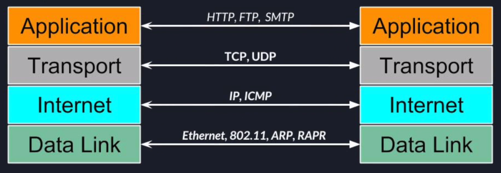

**_Layer 1 - Data Link_**

The data link layer defines the networking methods within the scope of the **local network** link on which hosts
communicate without intervening **routers**.

This layer includes the protocols used to describe the local network topology and the interfaces needed to affect the
transmission of internet layer datagrams to next-neighbor hosts.

For example, Ethernet protocol wraps the data into dataframes and uses machines MAC addresses to deliver data frames.

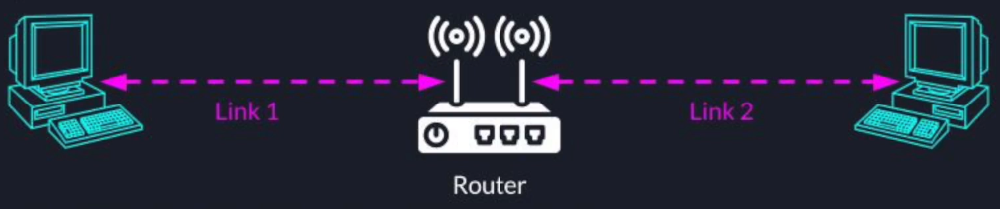

To summarize,

- Physical delivery of data over a single link
- In charge of:
    - encapsulation of data
    - flow control
    - error detection and correction, etc.
- Examples: Ethernet, 802.11 (Wi-Fi), ARP, RAPR, NDP, PPP, etc.

**_Layer 2 - Internet_**

The internet layer exchanges **datagrams** across network boundaries.

It provides a uniform networking interface that hides the actual topology (layout) of the underlying network
connections.

It is therefore also the layer that establishes inter-networking. Indeed, it defines and establishes the **Internet**.

This layer defines the addressing and routing structures used for the TCP/IP protocol suite.

The primary protocol in this scope is the **Internet Protocol**, which defines **IP addresses**.

Its function in routing is to transport datagrams to the next host, functioning as an IP router, that has the
connectivity to a network closer to the final data destination.

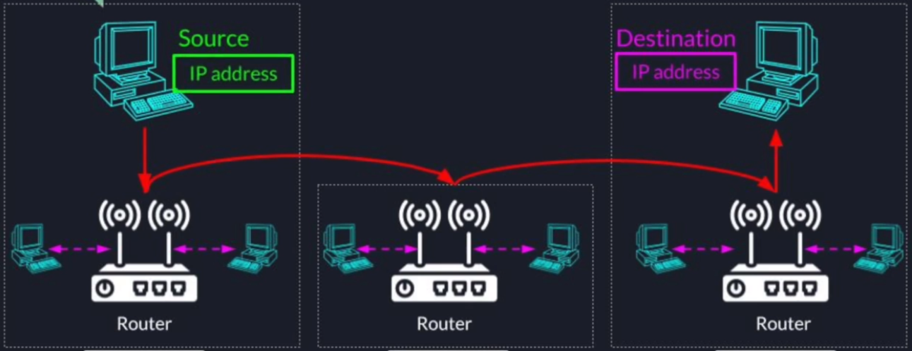

**_Layer 3 - Transport_**

The transport layer performs host-to-host communications on either the local network or remote networks separated by
**routers**.

It provides a channel for the communication needs of applications.

There are two main protocols in the transport layer:

- **Transmission Control Protocol (TCP)** provides flow-control, connection establishment, and reliable transmission of
  data:
    - Reliable - guarantees data delivery as sent, without any losses
    - Connection between 2 points needs to be created before data is sent and should be shut down in the end
    - Works as a streaming interface - stream of bytes flowing through the dedicated connection

- **User Datagram Protocol (UDP)** provides an unreliable connectionless datagram service:
    - Connectionless
    - Best effort - unreliable
    - Messages can be lost, duplicated or re-ordered
    - Based on a unit called _Datagram_ which is limited in size
    - Allows multicasting and broadcasting

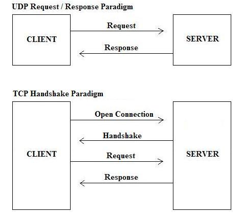

The main differences between TCP and UDP:

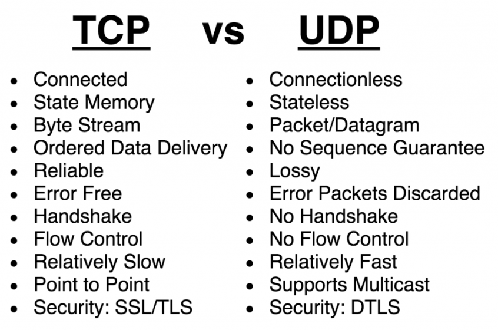

**_Layer 4 - Application_**

The application layer is the scope within which **applications**, or **processes**, create user data and communicate
this data to other applications on another or the same host.

The applications make use of the services provided by the underlying lower layers, especially the **transport layer**
which provides reliable or unreliable pipes to other processes.

The communications partners are characterized by the application architecture, such as the client–server model and
peer-to-peer networking. This is the layer in which all application protocols, such as SMTP, FTP, SSH, HTTP, operate.

Processes are addressed via ports which essentially represent services.

Encapsulation of application data descending through the layers:

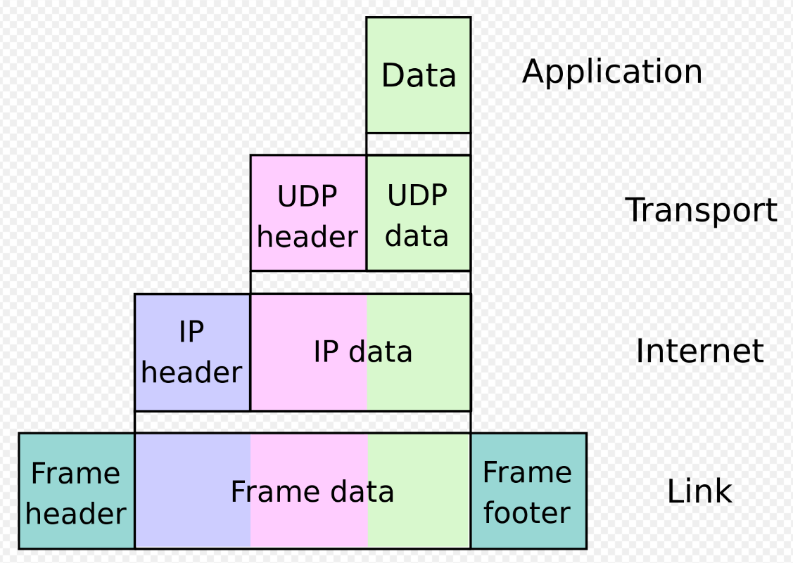

---

## Chapter 02. HTTP Basics

The **Hypertext Transfer Protocol (HTTP)** is an **application layer** protocol in the **Internet protocol suite model**
for distributed, collaborative, hypermedia information systems.

HTTP is the foundation of data communication for the **World Wide Web**, where hypertext documents include hyperlinks to
other resources that the user can easily access, for example, by a mouse click or by tapping the screen in a web
browser.

HTTP functions as a **request–response protocol** in the client–server model.

A **web browser**, for example, may be the client whereas a process, named **web server**, running on a computer hosting
one or more websites may be the **server**. The **client** submits an HTTP request message to the **server**.

The **server**, which provides resources such as HTML files and other content or performs other functions on behalf of
the client, returns a **response** message to the **client**.

The **response** contains completion status information about the request and may also contain requested content in its
message body.

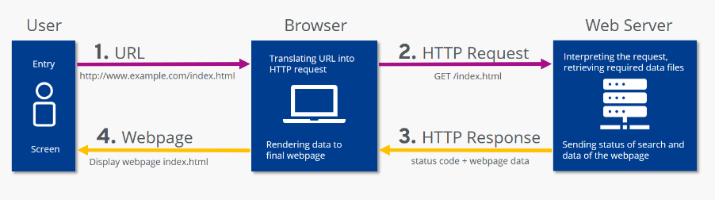

An example HTTP **request**:

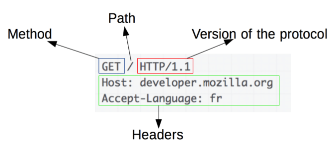

An example **response**:

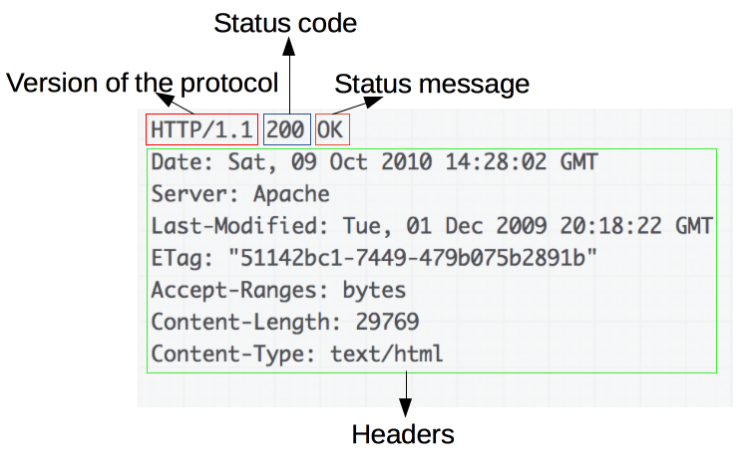

The first digit of the **status code** defines its class:

- **1XX (informational)**: The request was received, continuing process.
- **2XX (successful)**: The request was successfully received, understood, and accepted.
- **3XX (redirection)**: Further action needs to be taken in order to complete the request.
- **4XX (client error)**: The request contains bad syntax or cannot be fulfilled.
- **5XX (server error)**: The server failed to fulfill an apparently valid request.

**_HTTP Headers_**

HTTP header fields are a list of strings sent and received by both the client program and server on every HTTP request
and response.

HTTP headers let the client and the server pass additional information with an HTTP request or response.

An HTTP header consists of its case-insensitive name followed by a colon (:), then by its value. Whitespace before the
value is ignored.

These headers are usually invisible to the end-user and are only processed or logged by the server and client
applications.

They define how information sent/received through the connection is encoded (as in Content-Encoding), the session
verification and identification of the client (as in browser cookies, IP address, user-agent) or their anonymity
thereof (VPN or proxy masking, user-agent spoofing), how the server should handle data (as in Do-Not-Track), the age
(the time it has resided in a shared cache) of the document being downloaded, amongst others.

**_HTTP Methods_**

HTTP defines **methods** (sometimes referred to as **verbs**) to indicate the desired action to be performed on the
identified resource.

**GET**

GET method requests that the target resource transfer a representation of its state.

GET requests should only retrieve data and should have no other effect.

For retrieving resources without making changes, **GET** is preferred over **POST**, as they can be addressed through a
URL.

This enables bookmarking and sharing and makes GET responses eligible for caching, which can save bandwidth.

**POST**

The POST method requests that the target resource process the representation enclosed in the request according to the
semantics of the target resource.

For example, it is used for posting a message to an Internet forum, subscribing to a mailing list, or completing an
online shopping transaction.

**PUT**

The PUT method requests that the target resource create or update its state with the state defined by the representation
enclosed in the request.

A distinction from **POST** is that the client specifies the target location on the server.

**DELETE**

The DELETE method requests that the target resource delete its state.

**_HTTP versions_**

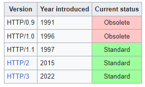

HTTP **resources** are identified and located on the network by **Uniform Resource Locators (URLs)**, using the
**Uniform Resource Identifiers (URI's)** schemes `http` and `https`.

URIs are encoded as `hyperlinks` in HTML documents to form interlinked hypertext documents.

- In `HTTP/1.0`, a **separate** TCP connection to the same server is made for every resource request
- In `HTTP/1.1`,
    - a TCP connection can be reused to make multiple resource requests (i.e., of HTML pages, frames,
      images, scripts, stylesheets, etc.)
    - communications therefore experience less latency as the establishment of TCP connections presents considerable
      overhead, especially under high traffic conditions
- In `HTTP/2`,
    - use a **compressed binary** representation of metadata (HTTP headers) instead of a **textual** one, so that
      headers require much less space
    - use a single TCP/IP (usually encrypted) connection per accessed server domain instead of 2 to 8 TCP/IP connections
    - use one or more **bidirectional** streams per TCP/IP connection in which HTTP requests and responses are broken
      down and transmitted in small packets to almost solve the problem of the HOLB (head-of-line blocking)
    - add a **push** capability to allow server application to send data to clients whenever new data is available
      (without forcing clients to request periodically new data to server by using polling methods)
- In `HTTP/3`,
    - revision of previous `HTTP/2` in order to use `QUIC + UDP` transport protocols instead of TCP
    - Before this version, TCP/IP connections were used, now only the IP layer (which UDP, like TCP, builds on) also
      is used to slightly improve the average speed of communications and to avoid the occasional (very rare) problem of
      TCP **connection congestion** that can temporarily block or slow down the data flow of all its streams (another
      form of HOLB or "head of line blocking")

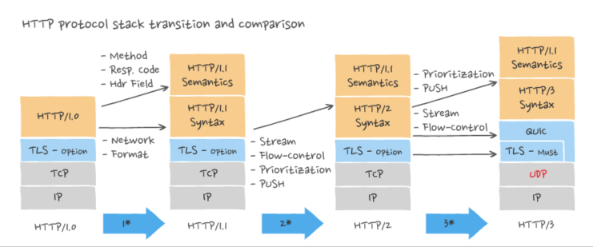

However, one can summarize the main difference between `HTTP/1.1` and `HTTP/2` is that `HTTP/2` supports
**multiplexing**:

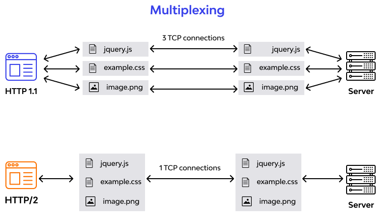

Similarly, the main difference between `HTTP/2` and `HTTP/3` is use of UDP and IP instead of TCP and the way
security is handled:

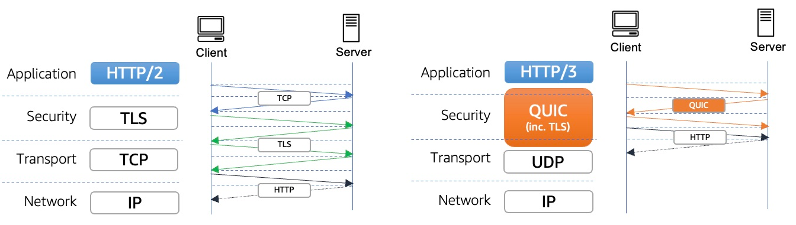

### Interview Problem 1 (JP Morgan Chase): What is HTTPS and how is it different from HTTP?

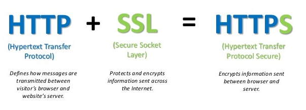

Main difference between `HTTP` and `HTTPS`:

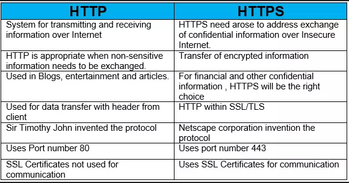

To show it in a diagram:

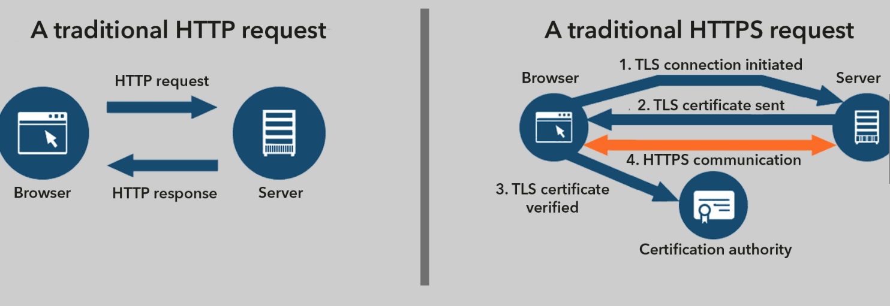

Short and sweet summary of differences:

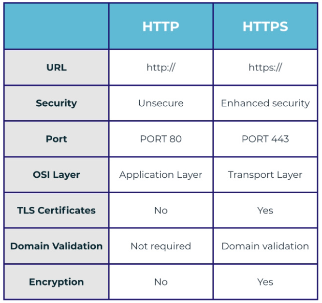

### HTTP Server

We are going to build an HTTP server which will be having two end points:

- "`/task`": using HTTP **POST**
- "`/status`": using HTTP **GET**

End point `/task` will accept a list or array of numbers and return the product.

End point `/status` will ensure the server is still alive.

We will also use some **custom header keys** in both HTTP **Request** and HTTP **Response**.

Complete code for our HTTP server:

```java
import com.sun.net.httpserver.Headers;
import com.sun.net.httpserver.HttpContext;
import com.sun.net.httpserver.HttpExchange;
import com.sun.net.httpserver.HttpServer;

import java.io.IOException;
import java.io.OutputStream;
import java.math.BigInteger;
import java.net.InetSocketAddress;
import java.nio.charset.StandardCharsets;
import java.time.Duration;
import java.time.Instant;
import java.util.Collections;
import java.util.concurrent.Executors;

public class GuidemyWebServer {

    private static final String TASK_ENDPOINT = "/task";
    private static final String STATUS_ENDPOINT = "/status";
    private static final String CUSTOM_HEADER_KEY1 = "Rishi-Test";
    private static final String CUSTOM_HEADER_KEY2 = "Rishi-Debug";
    private static final String CUSTOM_HEADER_RESPONSE_KEY = "Rishi-Debug-Info";

    private final int port;
    private HttpServer server;

    public GuidemyWebServer(final int port) {
        this.port = port;
    }

    public static void main(final String[] args) {
        int serverPort = 8080;
        if (args.length == 1) {
            serverPort = Integer.parseInt(args[0]);
        }

        final GuidemyWebServer webServer = new GuidemyWebServer(serverPort);
        webServer.startServer();

        System.out.printf("Server is listening on port: %d%n", serverPort);
    }

    public void startServer() {
        try {
            server = HttpServer.create(new InetSocketAddress(port), 0);
        } catch (final IOException e) {
            throw new RuntimeException(e);
        }

        final HttpContext statusContext = server.createContext(STATUS_ENDPOINT);
        final HttpContext taskContext = server.createContext(TASK_ENDPOINT);

        statusContext.setHandler(this::handleStatusCheckRequest);
        taskContext.setHandler(this::handleTaskRequest);

        server.setExecutor(Executors.newFixedThreadPool(4));
        server.start();
    }

    private void handleTaskRequest(final HttpExchange exchange) throws IOException {
        if (!exchange.getRequestMethod().equalsIgnoreCase(HttpMethod.POST.getHttpMethod())) {
            exchange.close();
            return;
        }

        final Headers headers = exchange.getRequestHeaders();
        if (headers.containsKey(CUSTOM_HEADER_KEY1)
                && headers.get(CUSTOM_HEADER_KEY1).get(0).equalsIgnoreCase("true")) {
            final String dummyResponse = "dummy\n";
            sendResponse(dummyResponse.getBytes(StandardCharsets.UTF_8), exchange);
            return;
        }

        boolean isDebugMode = false;
        if (headers.containsKey(CUSTOM_HEADER_KEY2)
                && headers.get(CUSTOM_HEADER_KEY2).get(0).equalsIgnoreCase("true")) {
            isDebugMode = true;
        }

        final Instant start = Instant.now();
        final byte[] requestBytes = exchange.getRequestBody().readAllBytes();
        final byte[] responseBytes = calculateResponse(requestBytes);

        if (isDebugMode) {
            final String debugMsg = String.format("Operation took %d ns%n", Duration.between(start, Instant.now()).toNanos());
            exchange.getResponseHeaders().put(CUSTOM_HEADER_RESPONSE_KEY, Collections.singletonList(debugMsg));
        }

        sendResponse(responseBytes, exchange);
    }

    private byte[] calculateResponse(final byte[] requestBytes) {
        final String bodyString = new String(requestBytes);
        final String[] stringNumbers = bodyString.split(",");
        BigInteger result = BigInteger.ONE;
        for (final String number : stringNumbers) {
            final BigInteger bigInteger = new BigInteger(number);
            result = result.multiply(bigInteger);
        }

        return String.format("Result of the multiplication is %s%n", result).getBytes(StandardCharsets.UTF_8);
    }

    private void handleStatusCheckRequest(final HttpExchange exchange) throws IOException {
        if (!exchange.getRequestMethod().equalsIgnoreCase(HttpMethod.GET.getHttpMethod())) {
            exchange.close();
            return;
        }

        final String responseMessage = "Server is alive";
        sendResponse(responseMessage.getBytes(StandardCharsets.UTF_8), exchange);
    }

    private void sendResponse(final byte[] responseBytes, final HttpExchange exchange) throws IOException {
        exchange.sendResponseHeaders(200, responseBytes.length);
        try (final OutputStream os = exchange.getResponseBody()) {
            os.write(responseBytes);
            os.flush();
        }
    }
}
```

Helper `enum` used in the server code:

```java
public enum HttpMethod {

    GET("GET"),
    POST("POST");

    private String httpMethod;

    HttpMethod(final String httpMethod) {
        this.httpMethod = httpMethod;
    }

    public String getHttpMethod() {
        return httpMethod;
    }
}
```

To test our server, we will use `cURL` on command line or GIT Bash.

**Test Case 1: Running GET request with invalid end point**

`curl --request GET -v localhost:8080/anything`

Output:

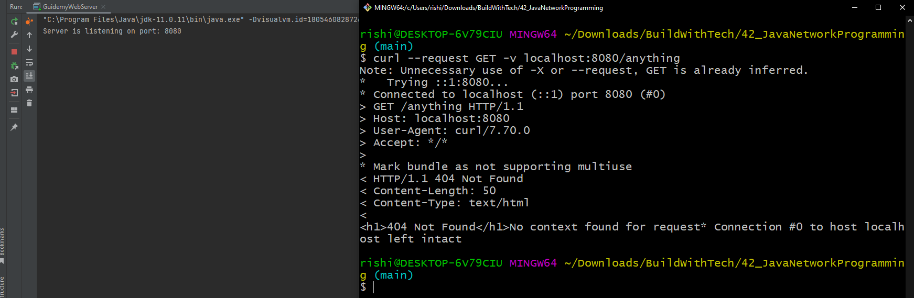

**Test Case 2: Running GET status request**

`curl --request GET -v localhost:8080/status`

Output:

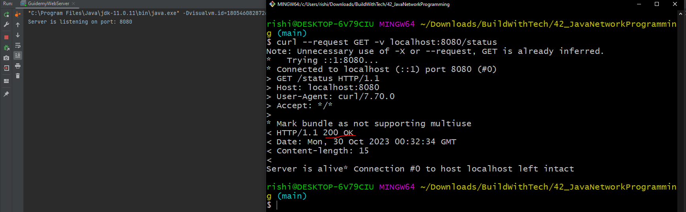

**Test Case 3: Running POST task request**

`curl --request POST -v --data '50,80,100' localhost:8080/task`

Output:

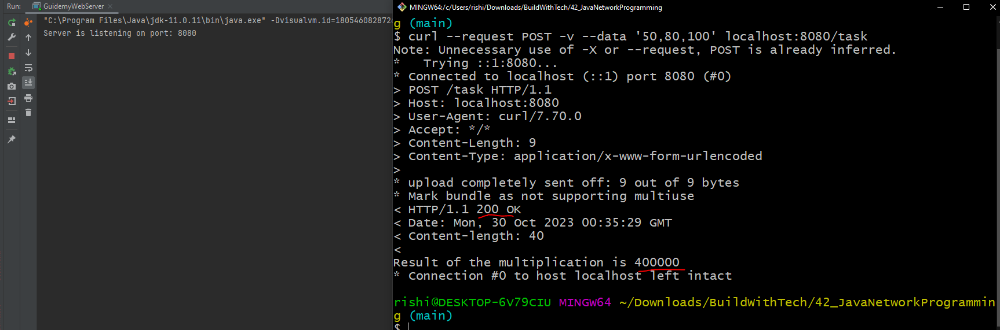

