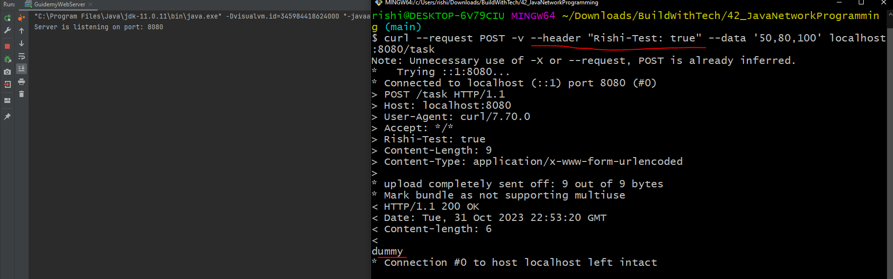
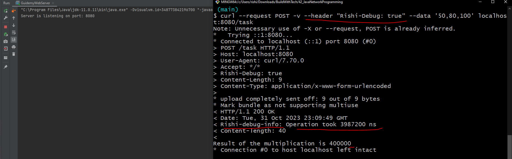
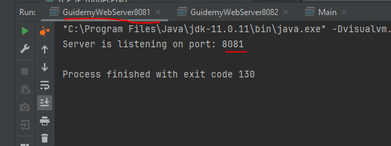
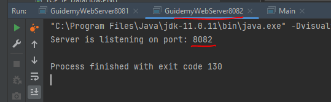
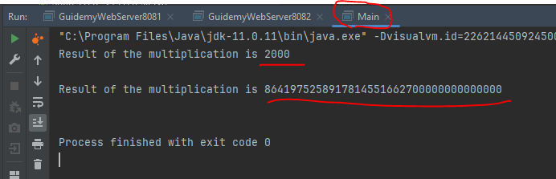
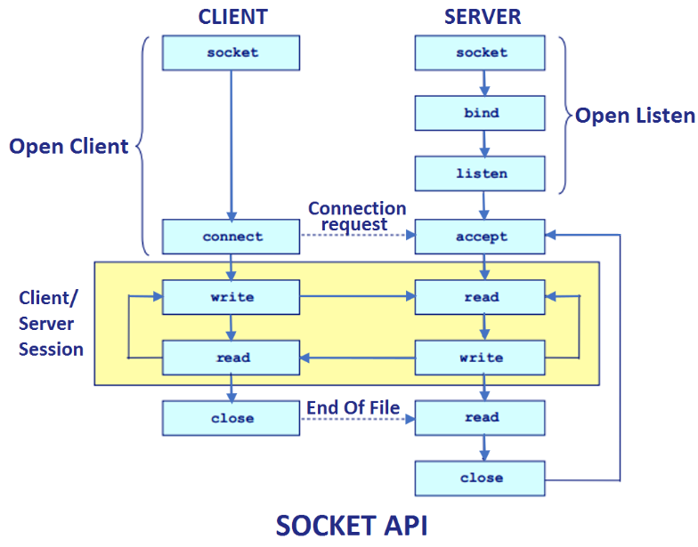
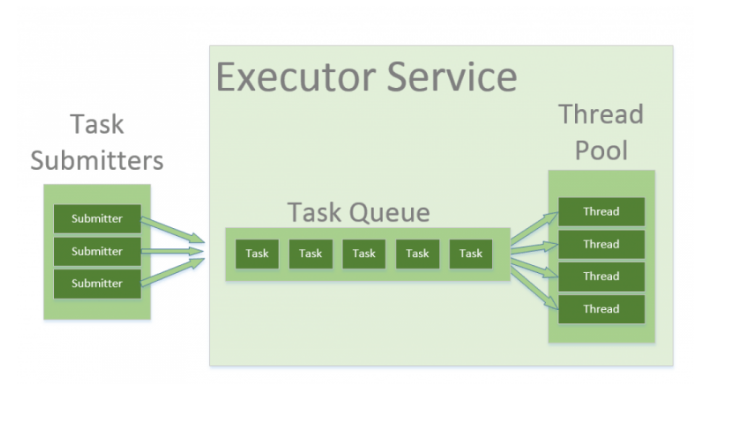
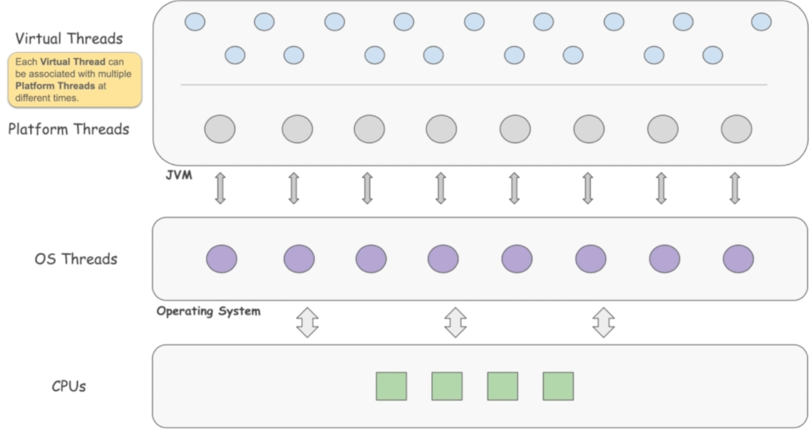
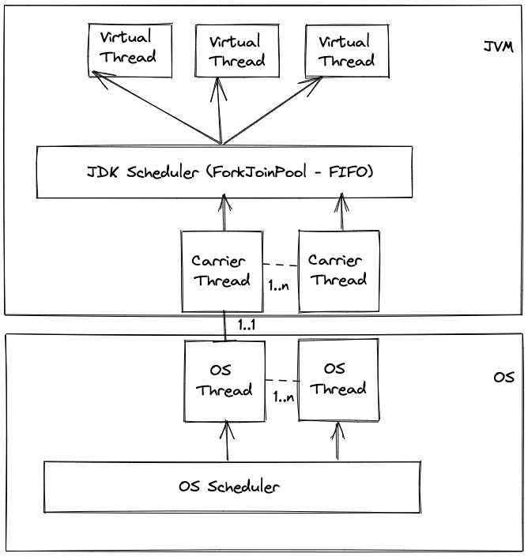
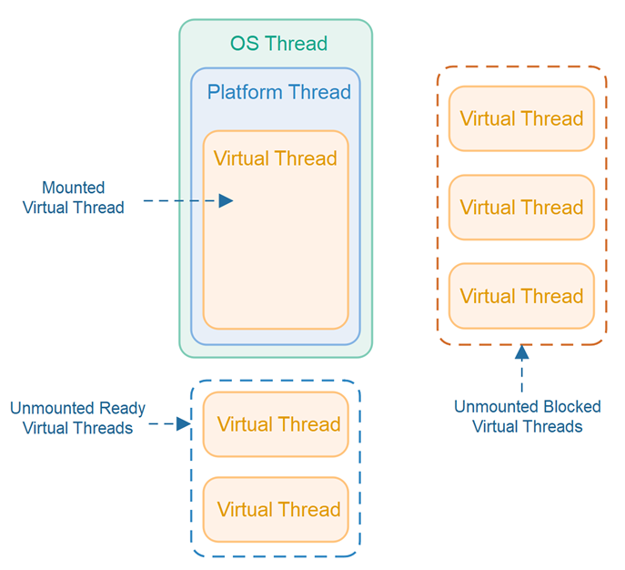

# Java Network Programming

> This is a Java course to understand java network programming with blocking and non-blocking IO.

Tools used:

- JDK 21
- Maven
- JUnit 5, Mockito
- IntelliJ IDE

## Table of contents

1. [Introduction to Networking](https://github.com/backstreetbrogrammer/42_JavaNetworkProgramming#chapter-01-introduction-to-networking)
    - [TCP/IP model](https://github.com/backstreetbrogrammer/42_JavaNetworkProgramming#tcpip-model)
2. [HTTP Basics](https://github.com/backstreetbrogrammer/42_JavaNetworkProgramming#chapter-02-http-basics)
    - [Interview Problem 1 (JP Morgan Chase): What is HTTPS and how is it different from HTTP?](https://github.com/backstreetbrogrammer/42_JavaNetworkProgramming#interview-problem-1-jp-morgan-chase-what-is-https-and-how-is-it-different-from-http)
    - [HTTP Server](https://github.com/backstreetbrogrammer/42_JavaNetworkProgramming#http-server)
    - [HTTP Client](https://github.com/backstreetbrogrammer/42_JavaNetworkProgramming#http-client)
3. [TCP Client and Server](https://github.com/backstreetbrogrammer/42_JavaNetworkProgramming#chapter-03-tcp-client-and-server)
    - [Limitation of current server applications](https://github.com/backstreetbrogrammer/42_JavaNetworkProgramming#limitation-of-current-server-applications)
    - [Blocking, Non-Blocking, Asynchronous Server](https://github.com/backstreetbrogrammer/42_JavaNetworkProgramming#blocking-non-blocking-asynchronous-server)
    - [Virtual Threads](https://github.com/backstreetbrogrammer/42_JavaNetworkProgramming#virtual-threads)
4. [UDP Client and Server](https://github.com/backstreetbrogrammer/42_JavaNetworkProgramming#chapter-04-udp-client-and-server)

---

## Chapter 01. Introduction to Networking

A communication protocol is a system of rules that allows two or more entities of a communications system to
transmit information via any variation of a physical quantity.

The protocol defines the rules, syntax, semantics, and synchronization of communication and possible error recovery
methods. Protocols may be implemented by hardware, software, or a combination of both.

The information exchanged between devices through a network or other media is governed by rules and conventions that can
be set out in communication protocol specifications.

These specifications, define the nature of communication, the actual data exchanged and any state-dependent behaviors.

In digital computing systems, the rules can be expressed by algorithms and data structures.

**Protocols** are to **communication** what **algorithms** or programming languages are to **computations**.

To implement a **networking protocol**, the protocol software modules are interfaced with a framework implemented on the
machine's operating system. This framework implements the networking functionality of the operating system.

When protocol algorithms are expressed in a portable programming language, the protocol software may be made operating
system independent. The best-known frameworks are the **TCP/IP model** and the **OSI model**.

**Types of communication protocols**

There are **two** types of communication protocols, based on their representation of the content being carried:

- **Text-based**: A text-based protocol or plain text protocol represents its content in human-readable format,
  often in plain text encoded in a machine-readable encoding such as `ASCII` or `UTF-8`, or in structured text-based
  formats such as `XML` or `JSON`.
  Examples: **FTP**, **SMTP**, **HTTP** (earlier versions), **Finger Protocol**

- **Binary**: A binary protocol utilizes all values of a `byte`, as opposed to a text-based protocol which only uses
  values corresponding to human-readable characters in `ASCII` encoding. Binary protocols are intended to be read by a
  machine rather than a human being. Binary protocols have the advantage of terseness, which translates into speed of
  transmission and interpretation.
  Examples: **HTTP/2**, **HTTP/3**, **EbXML**, **EDOC**

### TCP/IP model

The Internet protocol suite, commonly known as TCP/IP, is a framework for organizing the set of communication protocols
used in the Internet and similar computer networks according to functional criteria.

The foundational protocols in the suite are:

- Transmission Control Protocol (TCP)
- User Datagram Protocol (UDP)
- Internet Protocol (IP)


Conceptual data flow in a simple network topology of two hosts (A and B) connected by a link between their respective
routers.

The application on each host executes read and write operations as if the processes were directly connected to each
other by some kind of data pipe.

After establishment of this pipe, most details of the communication are hidden from each process, as the underlying
principles of communication are implemented in the lower protocol layers.

In analogy, at the transport layer the communication appears as host-to-host, without knowledge of the application data
structures and the connecting routers, while at the inter-networking layer, individual network boundaries are traversed
at each router.


**_Layer 1 - Data Link_**

The data link layer defines the networking methods within the scope of the **local network** link on which hosts
communicate without intervening **routers**.

This layer includes the protocols used to describe the local network topology and the interfaces needed to affect the
transmission of internet layer datagrams to next-neighbor hosts.

For example, Ethernet protocol wraps the data into dataframes and uses machines MAC addresses to deliver data frames.


To summarize,

- Physical delivery of data over a single link
- In charge of:
    - encapsulation of data
    - flow control
    - error detection and correction, etc.
- Examples: Ethernet, 802.11 (Wi-Fi), ARP, RAPR, NDP, PPP, etc.

**_Layer 2 - Internet_**

The internet layer exchanges **datagrams** across network boundaries.

It provides a uniform networking interface that hides the actual topology (layout) of the underlying network
connections.

It is therefore also the layer that establishes inter-networking. Indeed, it defines and establishes the **Internet**.

This layer defines the addressing and routing structures used for the TCP/IP protocol suite.

The primary protocol in this scope is the **Internet Protocol**, which defines **IP addresses**.

Its function in routing is to transport datagrams to the next host, functioning as an IP router, that has the
connectivity to a network closer to the final data destination.


**_Layer 3 - Transport_**

The transport layer performs host-to-host communications on either the local network or remote networks separated by
**routers**.

It provides a channel for the communication needs of applications.

There are two main protocols in the transport layer:

- **Transmission Control Protocol (TCP)** provides flow-control, connection establishment, and reliable transmission of
  data:
    - Reliable - guarantees data delivery as sent, without any losses
    - Connection between 2 points needs to be created before data is sent and should be shut down in the end
    - Works as a streaming interface - stream of bytes flowing through the dedicated connection

- **User Datagram Protocol (UDP)** provides an unreliable connectionless datagram service:
    - Connectionless
    - Best effort - unreliable
    - Messages can be lost, duplicated or re-ordered
    - Based on a unit called _Datagram_ which is limited in size
    - Allows multicasting and broadcasting


The main differences between TCP and UDP:


**_Layer 4 - Application_**

The application layer is the scope within which **applications**, or **processes**, create user data and communicate
this data to other applications on another or the same host.

The applications make use of the services provided by the underlying lower layers, especially the **transport layer**
which provides reliable or unreliable pipes to other processes.

The communications partners are characterized by the application architecture, such as the client–server model and
peer-to-peer networking. This is the layer in which all application protocols, such as SMTP, FTP, SSH, HTTP, operate.

Processes are addressed via ports which essentially represent services.

Encapsulation of application data descending through the layers:


---

## Chapter 02. HTTP Basics

The **Hypertext Transfer Protocol (HTTP)** is an **application layer** protocol in the **Internet protocol suite model**
for distributed, collaborative, hypermedia information systems.

HTTP is the foundation of data communication for the **World Wide Web**, where hypertext documents include hyperlinks to
other resources that the user can easily access, for example, by a mouse click or by tapping the screen in a web
browser.

HTTP functions as a **request–response protocol** in the client–server model.

A **web browser**, for example, may be the client whereas a process, named **web server**, running on a computer hosting
one or more websites may be the **server**. The **client** submits an HTTP request message to the **server**.

The **server**, which provides resources such as HTML files and other content or performs other functions on behalf of
the client, returns a **response** message to the **client**.

The **response** contains completion status information about the request and may also contain requested content in its
message body.


An example HTTP **request**:


An example **response**:


The first digit of the **status code** defines its class:

- **1XX (informational)**: The request was received, continuing process.
- **2XX (successful)**: The request was successfully received, understood, and accepted.
- **3XX (redirection)**: Further action needs to be taken in order to complete the request.
- **4XX (client error)**: The request contains bad syntax or cannot be fulfilled.
- **5XX (server error)**: The server failed to fulfill an apparently valid request.

**_HTTP Headers_**

HTTP header fields are a list of strings sent and received by both the client program and server on every HTTP request
and response.

HTTP headers let the client and the server pass additional information with an HTTP request or response.

An HTTP header consists of its case-insensitive name followed by a colon (:), then by its value. Whitespace before the
value is ignored.

These headers are usually invisible to the end-user and are only processed or logged by the server and client
applications.

They define how information sent/received through the connection is encoded (as in Content-Encoding), the session
verification and identification of the client (as in browser cookies, IP address, user-agent) or their anonymity
thereof (VPN or proxy masking, user-agent spoofing), how the server should handle data (as in Do-Not-Track), the age
(the time it has resided in a shared cache) of the document being downloaded, amongst others.

**_HTTP Methods_**

HTTP defines **methods** (sometimes referred to as **verbs**) to indicate the desired action to be performed on the
identified resource.

**GET**

GET method requests that the target resource transfer a representation of its state.

GET requests should only retrieve data and should have no other effect.

For retrieving resources without making changes, **GET** is preferred over **POST**, as they can be addressed through a
URL.

This enables bookmarking and sharing and makes GET responses eligible for caching, which can save bandwidth.

**POST**

The POST method requests that the target resource process the representation enclosed in the request according to the
semantics of the target resource.

For example, it is used for posting a message to an Internet forum, subscribing to a mailing list, or completing an
online shopping transaction.

**PUT**

The PUT method requests that the target resource create or update its state with the state defined by the representation
enclosed in the request.

A distinction from **POST** is that the client specifies the target location on the server.

**DELETE**

The DELETE method requests that the target resource delete its state.

**_HTTP versions_**


HTTP **resources** are identified and located on the network by **Uniform Resource Locators (URLs)**, using the
**Uniform Resource Identifiers (URI's)** schemes `http` and `https`.

URIs are encoded as `hyperlinks` in HTML documents to form interlinked hypertext documents.

- In `HTTP/1.0`, a **separate** TCP connection to the same server is made for every resource request
- In `HTTP/1.1`,
    - a TCP connection can be reused to make multiple resource requests (i.e., of HTML pages, frames,
      images, scripts, stylesheets, etc.)
    - communications therefore experience less latency as the establishment of TCP connections presents considerable
      overhead, especially under high traffic conditions
- In `HTTP/2`,
    - use a **compressed binary** representation of metadata (HTTP headers) instead of a **textual** one, so that
      headers require much less space
    - use a single TCP/IP (usually encrypted) connection per accessed server domain instead of 2 to 8 TCP/IP connections
    - use one or more **bidirectional** streams per TCP/IP connection in which HTTP requests and responses are broken
      down and transmitted in small packets to almost solve the problem of the HOLB (head-of-line blocking)
    - add a **push** capability to allow server application to send data to clients whenever new data is available
      (without forcing clients to request periodically new data to server by using polling methods)
- In `HTTP/3`,
    - revision of previous `HTTP/2` in order to use `QUIC + UDP` transport protocols instead of TCP
    - Before this version, TCP/IP connections were used, now only the IP layer (which UDP, like TCP, builds on) also
      is used to slightly improve the average speed of communications and to avoid the occasional (very rare) problem of
      TCP **connection congestion** that can temporarily block or slow down the data flow of all its streams (another
      form of HOLB or "head of line blocking")


However, one can summarize the main difference between `HTTP/1.1` and `HTTP/2` is that `HTTP/2` supports
**multiplexing**:


Similarly, the main difference between `HTTP/2` and `HTTP/3` is use of UDP and IP instead of TCP and the way
security is handled:


### Interview Problem 1 (JP Morgan Chase): What is HTTPS and how is it different from HTTP?


Main difference between `HTTP` and `HTTPS`:


To show it in a diagram:


Short and sweet summary of differences:


### HTTP Server

We are going to build an HTTP server which will be having two end points:

- "`/task`": using HTTP **POST**
- "`/status`": using HTTP **GET**

End point `/task` will accept a list or array of numbers and return the product.

End point `/status` will ensure the server is still alive.

We will also use some **custom header keys** in both HTTP **Request** and HTTP **Response**.

Complete code for our HTTP server:

```java
import com.sun.net.httpserver.Headers;
import com.sun.net.httpserver.HttpContext;
import com.sun.net.httpserver.HttpExchange;
import com.sun.net.httpserver.HttpServer;

import java.io.IOException;
import java.io.OutputStream;
import java.math.BigInteger;
import java.net.InetSocketAddress;
import java.nio.charset.StandardCharsets;
import java.time.Duration;
import java.time.Instant;
import java.util.Collections;
import java.util.concurrent.Executors;

public class GuidemyWebServer {

    private static final String TASK_ENDPOINT = "/task";
    private static final String STATUS_ENDPOINT = "/status";
    private static final String CUSTOM_HEADER_KEY1 = "Rishi-Test";
    private static final String CUSTOM_HEADER_KEY2 = "Rishi-Debug";
    private static final String CUSTOM_HEADER_RESPONSE_KEY = "Rishi-Debug-Info";

    private final int port;
    private HttpServer server;

    public GuidemyWebServer(final int port) {
        this.port = port;
    }

    public static void main(final String[] args) {
        int serverPort = 8080;
        if (args.length == 1) {
            serverPort = Integer.parseInt(args[0]);
        }

        final GuidemyWebServer webServer = new GuidemyWebServer(serverPort);
        webServer.startServer();

        System.out.printf("Server is listening on port: %d%n", serverPort);
    }

    public void startServer() {
        try {
            server = HttpServer.create(new InetSocketAddress(port), 0);
        } catch (final IOException e) {
            throw new RuntimeException(e);
        }

        final HttpContext statusContext = server.createContext(STATUS_ENDPOINT);
        final HttpContext taskContext = server.createContext(TASK_ENDPOINT);

        statusContext.setHandler(this::handleStatusCheckRequest);
        taskContext.setHandler(this::handleTaskRequest);

        server.setExecutor(Executors.newFixedThreadPool(4));
        server.start();
    }

    private void handleTaskRequest(final HttpExchange exchange) throws IOException {
        if (!exchange.getRequestMethod().equalsIgnoreCase(HttpMethod.POST.getHttpMethod())) {
            exchange.close();
            return;
        }

        final Headers headers = exchange.getRequestHeaders();
        if (headers.containsKey(CUSTOM_HEADER_KEY1)
                && headers.get(CUSTOM_HEADER_KEY1).get(0).equalsIgnoreCase("true")) {
            final String dummyResponse = "dummy\n";
            sendResponse(dummyResponse.getBytes(StandardCharsets.UTF_8), exchange);
            return;
        }

        boolean isDebugMode = false;
        if (headers.containsKey(CUSTOM_HEADER_KEY2)
                && headers.get(CUSTOM_HEADER_KEY2).get(0).equalsIgnoreCase("true")) {
            isDebugMode = true;
        }

        final Instant start = Instant.now();
        final byte[] requestBytes = exchange.getRequestBody().readAllBytes();
        final byte[] responseBytes = calculateResponse(requestBytes);

        if (isDebugMode) {
            final String debugMsg = String.format("Operation took %d ns", Duration.between(start, Instant.now()).toNanos());
            exchange.getResponseHeaders().put(CUSTOM_HEADER_RESPONSE_KEY, Collections.singletonList(debugMsg));
        }

        sendResponse(responseBytes, exchange);
    }

    private byte[] calculateResponse(final byte[] requestBytes) {
        final String bodyString = new String(requestBytes);
        final String[] stringNumbers = bodyString.split(",");
        BigInteger result = BigInteger.ONE;
        for (final String number : stringNumbers) {
            final BigInteger bigInteger = new BigInteger(number);
            result = result.multiply(bigInteger);
        }

        return String.format("Result of the multiplication is %s%n", result).getBytes(StandardCharsets.UTF_8);
    }

    private void handleStatusCheckRequest(final HttpExchange exchange) throws IOException {
        if (!exchange.getRequestMethod().equalsIgnoreCase(HttpMethod.GET.getHttpMethod())) {
            exchange.close();
            return;
        }

        final String responseMessage = "Server is alive";
        sendResponse(responseMessage.getBytes(StandardCharsets.UTF_8), exchange);
    }

    private void sendResponse(final byte[] responseBytes, final HttpExchange exchange) throws IOException {
        exchange.sendResponseHeaders(200, responseBytes.length);
        try (final OutputStream os = exchange.getResponseBody()) {
            os.write(responseBytes);
            os.flush();
        }
    }
}
```

Helper `enum` used in the server code:

```java
public enum HttpMethod {

    GET("GET"),
    POST("POST");

    private String httpMethod;

    HttpMethod(final String httpMethod) {
        this.httpMethod = httpMethod;
    }

    public String getHttpMethod() {
        return httpMethod;
    }
}
```

To test our server, we will use `cURL` on command line or GIT Bash.

**Test Case 1: Running GET request with invalid end point**

`curl --request GET -v localhost:8080/anything`

Output:


**Test Case 2: Running GET status request**

`curl --request GET -v localhost:8080/status`

Output:


**Test Case 3: Running POST task request**

`curl --request POST -v --data '50,80,100' localhost:8080/task`

Output:


**Test Case 4: Running POST task request with custom test header**

`curl --request POST -v --header "Rishi-Test: true" --data '50,80,100' localhost:8080/task`

Output:



**Test Case 5: Running POST task request with custom debug header**

`curl --request POST -v --header "Rishi-Debug: true" --data '50,80,100' localhost:8080/task`

Output:



### HTTP Client

Java 11 supports HTTP client creation. It supports both HTTP 1.1 and HTTP 2.

Here is our `GuidemyWebClient` class:

```java
import java.net.URI;
import java.net.http.HttpClient;
import java.net.http.HttpRequest;
import java.net.http.HttpResponse;
import java.util.concurrent.CompletableFuture;

public class GuidemyWebClient {

    private final HttpClient client;

    public GuidemyWebClient() {
        this.client = HttpClient.newBuilder()
                                .version(HttpClient.Version.HTTP_1_1)
                                .build();
    }

    public CompletableFuture<String> sendTask(final String url, final byte[] requestPayload) {
        final HttpRequest request = HttpRequest.newBuilder()
                                               .POST(HttpRequest.BodyPublishers.ofByteArray(requestPayload))
                                               .uri(URI.create(url))
                                               .build();

        return client.sendAsync(request, HttpResponse.BodyHandlers.ofString())
                     .thenApply(HttpResponse::body);
    }

}
```

Client is sending the HTTP POST request method **asynchronously** to the server and returning `HttpResponse` body
`String` wrapped inside `CompletableFuture<String>`.

Let's create a helper program to collect all the client requests and get all the results.

```java
import java.util.List;
import java.util.concurrent.CompletableFuture;
import java.util.stream.Collectors;
import java.util.stream.Stream;

public class Accumulator {

    private final GuidemyWebClient webClient;

    public Accumulator() {
        this.webClient = new GuidemyWebClient();
    }

    public List<String> sendTasksToWorkers(final List<String> workersAddresses, final List<String> tasks) {
        final CompletableFuture<String>[] futures = new CompletableFuture[workersAddresses.size()];

        for (int i = 0; i < workersAddresses.size(); i++) {
            final String workerAddress = workersAddresses.get(i);
            final String task = tasks.get(i);

            final byte[] requestPayload = task.getBytes();
            futures[i] = webClient.sendTask(workerAddress, requestPayload);
        }

        return Stream.of(futures)
                     .map(CompletableFuture::join)
                     .collect(Collectors.toList());
    }
}
```

For the demo servers run, we will run two instances of `GuidemyWebServer` running on ports `8081` and `8082`.





For the demo client run, we will use this `Main` class:

```java
import java.util.List;

public class Main {

    private static final String WORKER_ADDRESS_1 = "http://localhost:8081/task";
    private static final String WORKER_ADDRESS_2 = "http://localhost:8082/task";

    public static void main(final String[] args) {
        final Accumulator accumulator = new Accumulator();
        final String task1 = "10,200";
        final String task2 = "123456789,100000000000000,700000002342343";

        final List<String> results = accumulator.sendTasksToWorkers(List.of(WORKER_ADDRESS_1, WORKER_ADDRESS_2),
                                                                    List.of(task1, task2));

        for (final String result : results) {
            System.out.println(result);
        }
    }
}
```

Here is what the output will look like:



---

## Chapter 03. TCP Client and Server

### Limitation of current server applications

Server applications generally handle concurrent user requests that are independent of each other, so it makes sense for
an application to handle a request by dedicating a thread to that request for its entire duration.

This **thread-per-request** style is easy to understand, easy to program, and easy to debug and profile because it uses
the platform's unit of concurrency to represent the application's unit of concurrency.

The scalability of server applications is governed by **_Little's Law_**, which relates **latency**, **concurrency**,
and **throughput**:

For a given request-processing duration (i.e., **latency**), the number of requests an application handles at the same
time (i.e., **concurrency**) must grow in proportion to the rate of arrival (i.e., **throughput**).

For example, suppose an application with an average **latency** of `50ms` achieves a **throughput** of
`200 requests per second` by processing `10 requests` **concurrently**.

```
1 request takes 50 ms
2 requests takes 50*2=100 ms
20 requests takes 50*20=1000 ms or 1 second

Thus, to increase throughput from 20 requests per second to 200 requests per second, we need to process 10 requests 
concurrently.
```

In order for that application to scale to a **throughput** of `2000 requests per second`, it will need to process
`100 requests` **concurrently**.

If each request is handled in a thread for the request's duration then, for the application to keep up, the number of
threads must grow as throughput grows.

Unfortunately, the number of available threads is limited because the JDK implements threads as wrappers around
operating system (OS) threads.

OS threads are costly, so we cannot have too many of them, which makes the implementation ill-suited to the
**thread-per-request** style.

If each request consumes a thread, and thus an OS thread, for its duration, then the number of threads often becomes the
limiting factor long before other resources, such as CPU or network connections, are exhausted.

The JDK's current implementation of threads caps the application's throughput to a level well below what the hardware
can support.

This happens even when threads are pooled, since pooling helps avoid the high cost of starting a new thread but does not
increase the total number of threads.

### Blocking, Non-Blocking, Asynchronous Server

An example of TCP client-server socket connection:



```java
import java.io.IOException;
import java.net.ServerSocket;
import java.net.Socket;

public class SocketAPIDemoServer {

    public static void main(final String[] args) throws IOException {
        final var serverSocket = new ServerSocket(8080);
        while (!serverSocket.isClosed()) {
            final var socket = serverSocket.accept(); // blocks and socket can never be null
            handle(socket);
        }
    }

    private static void handle(final Socket socket) throws IOException {
        System.out.printf("Connected to %s%n", socket);
        try (
                socket;
                final var in = socket.getInputStream();
                final var out = socket.getOutputStream()
        ) {
            // default buffer size is 8192
            // in.transferTo(out);

            int data;
            while ((data = in.read()) != -1) { // read one byte at a time and -1 means EOF
                out.write(transformAndEcho(data));
            }
        } finally {
            System.out.printf("Disconnected from %s%n", socket);
        }
    }

    private static int transformAndEcho(final int data) {
        return Character.isLetter(data) ? data ^ ' ' : data;
    }
}
```

**Designing a simple TCP-based Order Management System (OMS) server**

Suppose, we have an Order Management System (OMS) which is working as a TCP server and receiving stock trading orders
from various clients.

Once the order is received, following processing is done on the `Order` object before it is sent down to algorithmic
trading engine or directly to exchange (DMA):

- Validate the order client's wallet if enough funds
- Enrich the order with latest market data (best bid / best ask)
- Update the latest order state to persistence (log or database)

**_Single Threaded Blocking OMS_**

```java
import java.io.IOException;
import java.net.ServerSocket;
import java.net.Socket;
import java.time.Duration;
import java.time.Instant;
import java.util.concurrent.atomic.AtomicInteger;

public class SingleThreadedBlockingOMS {

    private static final AtomicInteger clientCounter = new AtomicInteger();

    public static void main(final String[] args) throws IOException {
        final var port = 8080;
        final var serverSocket = new ServerSocket(port);
        System.out.printf("Listening on port %d%n", port);
        while (!serverSocket.isClosed()) {
            final var socket = serverSocket.accept(); // blocks and socket can never be null
            handle(socket);
        }
    }

    private static void handle(final Socket socket) {
        System.out.println("\n----------------------------");
        System.out.printf("Connected to Client-%d on socket=[%s]%n", clientCounter.addAndGet(1), socket);
        try (
                socket
        ) {
            final var start = Instant.now();
            final var request = new Request(socket);          // parse the request
            final var order = new Order(request);             // create an Order from the request

            order.validate(ClientWallet.validate(request))    // validate the order client's wallet if enough funds
                 .enrich(MarketData.enrich(request))          // enrich the order with latest market data
                 .persist(OrderStatePersist.persist(request)) // update the latest order state to persistence
                 .sendToDownstream();                         // send the order to downstream

            final var timeElapsed = (Duration.between(start, Instant.now()).toMillis());
            System.out.printf("%nOrder [%s] sent to downstream in [%d] ms%n%n", order, timeElapsed);

        } catch (final IOException e) {
            throw new RuntimeException(e);
        } finally {
            System.out.printf("Disconnected from Client-%d on socket=[%s]%n", clientCounter.get(), socket);
            System.out.println("----------------------------\n");
        }
    }

}
```

This server is purely sequential and uses a single thread that does everything.

The thread is first blocked on `accept()`, listening for connections.

After a connection is established, that thread performs all the handling work before it can go back to listen
and wait for more connections.

In the example code above, each of the following takes around `1 second`:

- parse the request
- create an Order from the request
- validate the order client's wallet if enough funds
- enrich the order with latest market data
- update the latest order state to persistence
- send the order to downstream

Therefore, it will take around `6 seconds` to complete **one** request and send the order to downstream (if no error).

This also means that if **three** requests arrive at the same time, it will take `6 + 6 + 6 = 18 seconds` to fulfill
them at `6 seconds` per request sequentially.

We will use the following `SocketClient` class to mimic client requests:

```java
import java.io.IOException;
import java.net.Socket;
import java.util.concurrent.TimeUnit;

public class SocketClient {

    public static void main(final String[] args) throws IOException, InterruptedException {
        if (args == null || args.length != 1) {
            throw new IllegalArgumentException("Specify the number of sockets to create and connect");
        }

        final var numberOfSocketsToCreate = Integer.parseInt(args[0]);
        if (numberOfSocketsToCreate <= 0) {
            throw new IllegalArgumentException("Number of sockets connection should be greater than 0");
        }

        final var sockets = new Socket[numberOfSocketsToCreate];

        // connect
        for (var i = 0; i < sockets.length; i++) {
            sockets[i] = new Socket("localhost", 8080);
            System.out.printf("Connected: [%s]%n", sockets[i]);
        }

        TimeUnit.SECONDS.sleep(1L);

        // disconnect
        for (final var socket : sockets) {
            if (socket != null) {
                socket.close();
                System.out.printf("Disconnected: [%s]%n", socket);
            }
        }
    }

}
```

**_Thread per client OMS_**

```java
import java.io.IOException;
import java.net.ServerSocket;
import java.net.Socket;
import java.time.Duration;
import java.time.Instant;
import java.util.concurrent.atomic.AtomicInteger;

public class ThreadPerClientOMS {

    private static final AtomicInteger clientCounter = new AtomicInteger();

    public static void main(final String[] args) throws IOException {
        final var port = 8080;
        final var serverSocket = new ServerSocket(port);
        System.out.printf("Listening on port %d%n", port);
        while (!serverSocket.isClosed()) {
            final var socket = serverSocket.accept(); // blocks and socket can never be null
            new Thread(() -> handle(socket, clientCounter.addAndGet(1))).start();    // create a new thread to handle request
        }
    }

    private static void handle(final Socket socket, final int clientNo) {
        System.out.println("\n----------------------------");
        System.out.printf("Connected to Client-%d on socket=[%s]%n", clientNo, socket);
        try (
                socket
        ) {
            final var start = Instant.now();
            final var request = new Request(socket);          // parse the request
            final var order = new Order(request);             // create an Order from the request

            order.validate(ClientWallet.validate(request))    // validate the order client's wallet if enough funds
                 .enrich(MarketData.enrich(request))          // enrich the order with latest market data
                 .persist(OrderStatePersist.persist(request)) // update the latest order state to persistence
                 .sendToDownstream();                         // send the order to downstream

            final var timeElapsed = (Duration.between(start, Instant.now()).toMillis());
            System.out.printf("%nOrder [%s] sent to downstream in [%d] ms%n%n", order, timeElapsed);

        } catch (final IOException e) {
            throw new RuntimeException(e);
        } finally {
            System.out.printf("Disconnected from Client-%d on socket=[%s]%n", clientNo, socket);
            System.out.println("----------------------------\n");
        }
    }

}
```

We can do a quick optimization to handle multiple connections in parallel by creating a new **Thread** for each client
handling.

```
        while (!serverSocket.isClosed()) {
            final Socket socket = serverSocket.accept(); // blocks and socket can never be null
            new Thread(() -> handle(socket)).start();    // create a new thread to handle request
        }
```

The connection listening thread that calls `accept()` creates and starts a new **Thread** to handle the connection and
quickly goes back to accepting more connections.

The `handle()` method is left unchanged, but it's now executed in parallel by multiple threads, each handling their
connection.

The computation time of the previous example goes from `6 + 6 + 6 = 18 seconds` to `max(6, 6, 6) = 6 seconds`.

Now all requests from separate users are completely independent.

However, there are few caveats:

- Within a single request in the `handle()` method => parsing, validating, persisting and sending the order to
  downstream is all done in the same thread.
- Threads are scarce, and there is a limitation imposed on the maximum number of threads which can be created in an
  OS. Thus, the design doesn't scale well when the number of client connections will increase.

**_Thread per client and Thread per order-parsing OMS_**

```java
import java.io.IOException;
import java.net.ServerSocket;
import java.net.Socket;
import java.time.Duration;
import java.time.Instant;
import java.util.List;
import java.util.concurrent.atomic.AtomicInteger;

public class ThreadPerOrderHandlerOMS {

    private static final AtomicInteger clientCounter = new AtomicInteger();

    public static void main(final String[] args) throws IOException {
        final var port = 8080;
        final var serverSocket = new ServerSocket(port);
        System.out.printf("Listening on port %d%n", port);
        while (!serverSocket.isClosed()) {
            final var socket = serverSocket.accept(); // blocks and socket can never be null
            new Thread(() -> handle(socket, clientCounter.addAndGet(1))).start();    // create a new thread to handle request
        }
    }

    private static void handle(final Socket socket, final int clientNo) {
        System.out.println("\n----------------------------");
        System.out.printf("Connected to Client-%d on socket=[%s]%n", clientNo, socket);
        try (
                socket
        ) {
            final var start = Instant.now();
            final var request = new Request(socket);          // parse the request
            final var order = new Order(request);             // create an Order from the request

            final var threads = getOrderParsingThreads(order, request);
            for (final var t : threads) {
                t.start();
            }
            for (final var t : threads) {
                t.join();
            }

            // send the order to downstream
            order.sendToDownstream();

            final var timeElapsed = (Duration.between(start, Instant.now()).toMillis());
            System.out.printf("%nOrder [%s] sent to downstream in [%d] ms%n%n", order, timeElapsed);

        } catch (final IOException | InterruptedException e) {
            throw new RuntimeException(e);
        } finally {
            System.out.printf("Disconnected from Client-%d on socket=[%s]%n", clientNo, socket);
            System.out.println("----------------------------\n");
        }
    }

    private static List<Thread> getOrderParsingThreads(final Order order, final Request request) {
        // validate the order client's wallet if enough funds
        final var t1 = new Thread(() -> order.validate(ClientWallet.validate(request)));

        // enrich the order with latest market data
        final var t2 = new Thread(() -> order.enrich(MarketData.enrich(request)));

        // update the latest order state to persistence
        final var t3 = new Thread(() -> order.persist(OrderStatePersist.persist(request)));

        return List.of(t1, t2, t3);
    }

}
```

The first issue above can be easily fixed by using multiple threads for order parsing, validating, persisting and
sending the order to downstream.

After a request is parsed and an order is created, three helper threads are created: one for validating, one to enrich,
and one to persist the order.

The three threads are then started and begin to execute their code in parallel.

The `join` method is a blocking method that waits for a thread to terminate.

After all three of the helper threads are terminated, the connection-handling thread sends the fully assembled order
to downstream, and the time to process a request becomes `1 + 1 + max(1, 1, 1) + 1 = 4 seconds`.

This is a pattern sometimes known as `fork/join` or `scatter/gather`.

However, this design has again few caveats:

- the order needs to be created before the threads are started, and this order object needs to be **thread-safe**,
  because the `validate`, `enrich`, and `persist` methods are potentially called concurrently (and presumably could each
  modify the order). Therefore, these methods will need to use proper synchronization (such as locks) to make sure the
  threads don't interfere with each other in unwanted ways.

```
    public synchronized Order validate(final Order validatedOrder) {
        // validation logic...
        return validatedOrder;
    }

    public synchronized Order enrich(final Order enrichedOrder) {
        // enrichment logic...
        return enrichedOrder;
    }

    public synchronized Order persist(final Order persistedOrder) {
        // persistence logic...
        return persistedOrder;
    }

    public synchronized void sendToDownstream() {
        // connection logic to downstream...
        waitForOneSecond();
    }
```

- inefficient and uncontrolled thread creation - for `n` simultaneous connections, there could be `4n` threads created
  and destroyed each time.

```java
import java.io.IOException;
import java.net.ServerSocket;
import java.net.Socket;
import java.time.Duration;
import java.time.Instant;
import java.util.List;
import java.util.concurrent.atomic.AtomicInteger;

public class ThreadPerOrderHandlerOptimisedOMS {

    private static final AtomicInteger clientCounter = new AtomicInteger();

    public static void main(final String[] args) throws IOException {
        final var port = 8080;
        final var serverSocket = new ServerSocket(port);
        System.out.printf("Listening on port %d%n", port);
        while (!serverSocket.isClosed()) {
            final var socket = serverSocket.accept(); // blocks and socket can never be null
            new Thread(() -> handle(socket, clientCounter.addAndGet(1))).start();    // create a new thread to handle request
        }
    }

    private static void handle(final Socket socket, final int clientNo) {
        System.out.println("\n----------------------------");
        System.out.printf("Connected to Client-%d on socket=[%s]%n", clientNo, socket);
        try (
                socket
        ) {
            final var start = Instant.now();
            final var request = new Request(socket);          // parse the request
            final var order = new Order(request);             // create an Order from the request

            final var threads = getOrderParsingThreads(order, request);
            for (final var t : threads) {
                t.start();
            }

            // update the latest order state to persistence
            order.persist(OrderStatePersist.persist(request));

            for (final var t : threads) {
                t.join();
            }

            // send the order to downstream
            order.sendToDownstream();

            final var timeElapsed = (Duration.between(start, Instant.now()).toMillis());
            System.out.printf("%nOrder [%s] sent to downstream in [%d] ms%n%n", order, timeElapsed);

        } catch (final IOException | InterruptedException e) {
            throw new RuntimeException(e);
        } finally {
            System.out.printf("Disconnected from Client-%d on socket=[%s]%n", clientNo, socket);
            System.out.println("----------------------------\n");
        }
    }

    private static List<Thread> getOrderParsingThreads(final Order order, final Request request) {
        // validate the order client's wallet if enough funds
        final var t1 = new Thread(() -> order.validate(ClientWallet.validate(request)));

        // enrich the order with latest market data
        final var t2 = new Thread(() -> order.enrich(MarketData.enrich(request)));

        return List.of(t1, t2);
    }

}
```

We can do a small optimization here that instead of creating `4n` threads, we can use the connection handling thread
to make it `3n` threads per request.

This design is slightly better - `3n` threads instead of `4n` but it's still unnecessarily wasteful of threads.

And, the time to process a request is still same: `1 + 1 + max(1, 1, 1) + 1 = 4 seconds`.

A better approach is to **pool** generic worker threads together and rely on them as tasks occur.

**Thread pools** were introduced because threads are expensive; when threads become cheaper, the need for pooling
decreases.

**_Thread Pool Based OMS_**

```java
import java.io.IOException;
import java.net.ServerSocket;
import java.net.Socket;
import java.time.Duration;
import java.time.Instant;
import java.util.concurrent.CountDownLatch;
import java.util.concurrent.ExecutorService;
import java.util.concurrent.Executors;
import java.util.concurrent.atomic.AtomicInteger;

public class ThreadPoolBasedOMS {

    private static final AtomicInteger clientCounter = new AtomicInteger();
    private static final ExecutorService connectionHandlerPool = Executors.newFixedThreadPool(4);
    private static final ExecutorService orderHandlerPool = Executors.newFixedThreadPool(12);

    public static void main(final String[] args) throws IOException {
        final var port = 8080;
        final var serverSocket = new ServerSocket(port);
        System.out.printf("Listening on port %d%n", port);

        try {
            while (!serverSocket.isClosed()) {
                final var socket = serverSocket.accept(); // blocks and socket can never be null
                connectionHandlerPool.execute(() -> handle(socket, clientCounter.addAndGet(1)));
            }
        } finally {
            connectionHandlerPool.close();
            orderHandlerPool.close();
        }
    }

    private static void handle(final Socket socket, final int clientNo) {
        System.out.println("\n----------------------------");
        System.out.printf("Connected to Client-%d on socket=[%s]%n", clientNo, socket);
        try (
                socket
        ) {
            final var start = Instant.now();
            final var request = new Request(socket);          // parse the request
            final var order = new Order(request);             // create an Order from the request

            final var latch = new CountDownLatch(3);

            orderHandlerPool.execute(() -> {
                order.validate(ClientWallet.validate(request));
                latch.countDown();
            });

            orderHandlerPool.execute(() -> {
                order.enrich(MarketData.enrich(request));
                latch.countDown();
            });

            orderHandlerPool.execute(() -> {
                order.persist(OrderStatePersist.persist(request));
                latch.countDown();
            });

            latch.await();

            // send the order to downstream
            order.sendToDownstream();

            final var timeElapsed = (Duration.between(start, Instant.now()).toMillis());
            System.out.printf("%nOrder [%s] sent to downstream in [%d] ms%n%n", order, timeElapsed);

        } catch (final IOException | InterruptedException e) {
            throw new RuntimeException(e);
        } finally {
            System.out.printf("Disconnected from Client-%d on socket=[%s]%n", clientNo, socket);
            System.out.println("----------------------------\n");
        }
    }

}
```

The **Executor Pattern** aims to fix the above-mentioned issues:

- by creating pools of ready-to-use threads
- passing tasks to this pool of threads that will execute it



The threads in this pool will be kept alive as long as this pool is alive.

It means that the single thread will execute the submitted task => once the task finishes, the thread will return to the
pool and wait for a new task to be submitted for execution.

As compared to `Runnable` pattern, `Executor` pattern does NOT create a new thread.

However, the behavior is the same: both calls return immediately, and the task is executed in **another** thread.

We will create two thread pools in our OMS:

```
    private static final ExecutorService connectionHandlerPool = Executors.newFixedThreadPool(4);
    private static final ExecutorService orderHandlerPool = Executors.newFixedThreadPool(12);
```

Our client handler code will look like this:

```
        try {
            while (!serverSocket.isClosed()) {
                final var socket = serverSocket.accept(); // blocks and socket can never be null
                connectionHandlerPool.execute(() -> handle(socket));
            }
        } finally {
            connectionHandlerPool.close();
            orderHandlerPool.close();
        }
```

And, the order handler code will be changed to use the second pool:

```
            final var request = new Request(socket);          // parse the request
            final var order = new Order(request);             // create an Order from the request

            final var latch = new CountDownLatch(3);

            orderHandlerPool.execute(() -> {
                order.validate(ClientWallet.validate(request));
                latch.countDown();
            });

            orderHandlerPool.execute(() -> {
                order.enrich(MarketData.enrich(request));
                latch.countDown();
            });

            orderHandlerPool.execute(() -> {
                order.persist(OrderStatePersist.persist(request));
                latch.countDown();
            });

            latch.await();

            // send the order to downstream
            order.sendToDownstream();
```

This is a better design as now we have a limited number of threads as guaranteed in the thread pool size.

However, the time to process a request is still same: `1 + 1 + max(1, 1, 1) + 1 = 4 seconds`.

Few of the caveats here are:

- order is a shared object amongst all the threads and needs to be synchronized
- code is more complex and using helper objects like `CountDownLatch`

The OMS servers we have created so far are very imperative in style:

- Threads do things
- they act on a shared object, and
- they modify it

A better approach is to use **futures**.

**_Futures Based OMS_**

```java
import java.io.IOException;
import java.net.ServerSocket;
import java.net.Socket;
import java.time.Duration;
import java.time.Instant;
import java.util.concurrent.CompletableFuture;
import java.util.concurrent.ExecutorService;
import java.util.concurrent.Executors;
import java.util.concurrent.atomic.AtomicInteger;

public class FuturesBasedOMS {

    private static final AtomicInteger clientCounter = new AtomicInteger();
    private static final ExecutorService connectionHandlerPool = Executors.newFixedThreadPool(4);
    private static final ExecutorService orderHandlerPool = Executors.newFixedThreadPool(12);

    public static void main(final String[] args) throws IOException {
        final var port = 8080;
        final var serverSocket = new ServerSocket(port);
        System.out.printf("Listening on port %d%n", port);

        try {
            while (!serverSocket.isClosed()) {
                final var socket = serverSocket.accept(); // blocks and socket can never be null
                connectionHandlerPool.execute(() -> handle(socket, clientCounter.addAndGet(1)));
            }
        } finally {
            connectionHandlerPool.close();
            orderHandlerPool.close();
        }
    }

    private static void handle(final Socket socket, final int clientNo) {
        System.out.println("\n----------------------------");
        System.out.printf("Connected to Client-%d on socket=[%s]%n", clientNo, socket);
        try (
                socket
        ) {
            final var start = Instant.now();
            final var request = new Request(socket);

            final var orderValidateFuture =
                    CompletableFuture.supplyAsync(() -> ClientWallet.validate(request), orderHandlerPool);
            final var orderEnrichFuture =
                    CompletableFuture.supplyAsync(() -> MarketData.enrich(request), orderHandlerPool);
            final var orderPersistFuture =
                    CompletableFuture.supplyAsync(() -> OrderStatePersist.persist(request), orderHandlerPool);

            new Order(request)
                    .validate(orderValidateFuture.join())
                    .enrich(orderEnrichFuture.join())
                    .persist(orderPersistFuture.join())
                    .sendToDownstream();

            final var timeElapsed = (Duration.between(start, Instant.now()).toMillis());
            System.out.printf("%nOrder sent to downstream in [%d] ms%n%n", timeElapsed);

        } catch (final IOException e) {
            throw new RuntimeException(e);
        } finally {
            System.out.printf("Disconnected from Client-%d on socket=[%s]%n", clientNo, socket);
            System.out.println("----------------------------\n");
        }
    }

}
```

Futures are a standard Java abstraction that allows concurrent code to shift to a more **functional** flavor in which
threads run functions and produce values, while combining the synchronization capabilities of the **latch** mechanism
used earlier.

Essentially, a **future** represents an **asynchronously** running function and offers mechanisms for threads to wait
for the output of the function.

Running a blocking code in another thread is a way to avoid blocking the main thread of our application.

```
        ExecutorService service = ...;
        HTTPClient client = ...;
        Future<String> future =
                service.submit(() – >
                        client.get("https://github.com/backstreetbrogrammer/data"));
        // do some other stuff
        String response = future.get();
```

The call to `get()` is still a **blocking** call, but blocks another thread and not the `main` thread. Our application
thread is free to do something else.

We can get the response through this `future` object By calling `future.get()`, which is a blocking call.

Java 8's Concurrent API introduced `CompletableFuture`, a valuable tool for simplifying asynchronous and non-blocking
programming.

The `CompletableFuture` class implements `CompletionStage` interface and the `Future` interface.

Now, our order handling logic completely changes like this:

```
            final var request = new Request(socket);

            final var orderValidateFuture =
                    CompletableFuture.supplyAsync(() -> ClientWallet.validate(request), orderHandlerPool);
            final var orderEnrichFuture =
                    CompletableFuture.supplyAsync(() -> MarketData.enrich(request), orderHandlerPool);
            final var orderPersistFuture =
                    CompletableFuture.supplyAsync(() -> OrderStatePersist.persist(request), orderHandlerPool);

            new Order(request)
                    .validate(orderValidateFuture.join())
                    .enrich(orderEnrichFuture.join())
                    .persist(orderPersistFuture.join())
                    .sendToDownstream();
```

The implementation of the server is fairly straightforward:

Simply create a **future** for any part of the computation that needs to run **asynchronously**.

This approach pools threads for reuse, avoids the **latch** (futures implement their own **synchronization**), and,
importantly, the **order** is created and populated by a **single** thread and does not need to be **thread-safe**
anymore.

The new order object is created by the connection-handling thread **in parallel** with the validation, enrichment and
persistence tasks (which no longer need the order).

Thus, the time to process a request and send the order to downstream goes down from
`1 + 1 + max(1, 1, 1) + 1 = 4 seconds` to `1 + max(1, 1, 1) + 1 = 3 seconds`.

However, the fact that threads are **blocked** on the `join` method while waiting for futures to be completed remains
problematic in two ways:

- This **blocking** invites the possibility of **deadlocks**. The issue was addressed here by using **two** separate
  thread pools. On larger, more complex systems, however, the problem can become quite tricky. **Multiplying pools** or
  **increasing pool sizes** to guarantee the absence of deadlocks tends to result in a large number of threads which,
  when they are not blocked, lead to a suboptimal usage of computing resources.
- Blocking and unblocking threads, even in the best of scenarios, has a non-negligible cost. The actual **parking** and
  **unparking** of threads by the operating system take time. Furthermore, parked threads tend to see their data in
  processor-level caches overwritten by other threads, resulting in cache misses when the threads resume execution.
  Accordingly, techniques were devised to minimize thread blocking, ideally, to avoid it entirely.

**_Futures with Callbacks OMS_**

```java
import java.io.IOException;
import java.net.ServerSocket;
import java.net.Socket;
import java.time.Duration;
import java.time.Instant;
import java.util.concurrent.CompletableFuture;
import java.util.concurrent.ExecutorService;
import java.util.concurrent.Executors;
import java.util.concurrent.atomic.AtomicInteger;

public class FuturesWithCallbacksOMS {

    private static final AtomicInteger clientCounter = new AtomicInteger();
    private static final ExecutorService threadPool = Executors.newFixedThreadPool(12);

    public static void main(final String[] args) throws IOException {
        final var port = 8080;
        final var serverSocket = new ServerSocket(port);
        System.out.printf("Listening on port %d%n", port);

        try {
            while (!serverSocket.isClosed()) {
                final var socket = serverSocket.accept(); // blocks and socket can never be null
                threadPool.execute(() -> handle(socket, clientCounter.addAndGet(1)));
            }
        } finally {
            threadPool.close();
        }
    }

    private static void handle(final Socket socket, final int clientNo) {
        System.out.println("\n----------------------------");
        System.out.printf("Connected to Client-%d on socket=[%s]%n", clientNo, socket);
        try (
                socket
        ) {
            final var start = Instant.now();
            final var request = new Request(socket);

            final var orderValidateFuture =
                    CompletableFuture.supplyAsync(() -> ClientWallet.validate(request), threadPool);
            final var orderEnrichFuture =
                    CompletableFuture.supplyAsync(() -> MarketData.enrich(request), threadPool);
            final var orderPersistFuture =
                    CompletableFuture.supplyAsync(() -> OrderStatePersist.persist(request), threadPool);

            final var order = new Order(request);

            orderValidateFuture.thenAccept(
                    validatedOrder ->
                            orderEnrichFuture.thenAccept(
                                    enrichedOrder ->
                                            orderPersistFuture.thenAccept(
                                                    persistedOrder ->
                                                            order.validate(validatedOrder)
                                                                 .enrich(enrichedOrder)
                                                                 .persist(persistedOrder)
                                                                 .sendToDownstream())));

            final var timeElapsed = (Duration.between(start, Instant.now()).toMillis());
            System.out.printf("%nOrder [%s] sent to downstream in [%d] ms%n%n", order, timeElapsed);

        } catch (final IOException e) {
            throw new RuntimeException(e);
        } finally {
            System.out.printf("Disconnected from Client-%d on socket=[%s]%n", clientNo, socket);
            System.out.println("----------------------------\n");
        }
    }

}
```

One of the oldest strategies is the idea of a **callback**.

Instead of waiting for the result of a future, which requires **blocking**, the developer specifies, as a **callback**,
the computation that will use this result.

Time taken is same as before: `1 + max(1, 1, 1) + 1 = 3 seconds`.

The future `thenAccept` method takes as its argument the code that will **consume** the output of the future.

Note that the invocation of `thenAccept` only registers this code for **later execution**; it does not wait for the
future to be completed and, thus, it takes very little time.

The actual object building will run later, in the thread pool, after the validation, enrichment and persistence tasks
are done. As a result, a single request is processed in one second as before.

Threads are never blocked in this server, and a single, reasonably sized pool can be used.

The code above is **free from deadlocks** for any pool size.

Indeed, setting `threadPool` as a **single-thread pool** would result in a sequential server, but would not cause any
deadlock.

However, still there is one caveat here:

- Callbacks are notoriously hard to write and even harder to debug.

In the simple callback illustration above, `thenAccept` calls are nested **three levels** deep.

**_Futures with composition OMS_**

```java
import java.io.IOException;
import java.net.ServerSocket;
import java.net.Socket;
import java.time.Duration;
import java.time.Instant;
import java.util.concurrent.CompletableFuture;
import java.util.concurrent.ExecutorService;
import java.util.concurrent.Executors;
import java.util.concurrent.atomic.AtomicInteger;

public class FuturesWithCompositionOMS {

    private static final AtomicInteger clientCounter = new AtomicInteger();
    private static final ExecutorService threadPool = Executors.newFixedThreadPool(12);

    public static void main(final String[] args) throws IOException {
        final var port = 8080;
        final var serverSocket = new ServerSocket(port);
        System.out.printf("Listening on port %d%n", port);

        try {
            while (!serverSocket.isClosed()) {
                final var socket = serverSocket.accept(); // blocks and socket can never be null
                threadPool.execute(() -> handle(socket, clientCounter.addAndGet(1)));
            }
        } finally {
            threadPool.close();
        }
    }

    private static void handle(final Socket socket, final int clientNo) {
        System.out.println("\n----------------------------");
        System.out.printf("Connected to Client-%d on socket=[%s]%n", clientNo, socket);
        try (
                socket
        ) {
            final var start = Instant.now();
            final var request = new Request(socket);

            final var orderValidateFuture =
                    CompletableFuture.supplyAsync(() -> ClientWallet.validate(request), threadPool);
            final var orderEnrichFuture =
                    CompletableFuture.supplyAsync(() -> MarketData.enrich(request), threadPool);
            final var orderPersistFuture =
                    CompletableFuture.supplyAsync(() -> OrderStatePersist.persist(request), threadPool);

            CompletableFuture.completedFuture(new Order(request))
                             .thenCombine(orderValidateFuture, Order::validate)
                             .thenCombine(orderEnrichFuture, Order::enrich)
                             .thenCombine(orderPersistFuture, Order::persist)
                             .thenAccept(Order::sendToDownstream);

            final var timeElapsed = (Duration.between(start, Instant.now()).toMillis());
            System.out.printf("%nOrder sent to downstream in [%d] ms%n%n", timeElapsed);

        } catch (final IOException e) {
            throw new RuntimeException(e);
        } finally {
            System.out.printf("Disconnected from Client-%d on socket=[%s]%n", clientNo, socket);
            System.out.println("----------------------------\n");
        }
    }

}
```

Fortunately, modern futures offer other mechanisms to process their value in a non-blocking fashion.

In Java, a `thenCombine` method can be used to **combine** the results of two futures using a two-argument function.

Time taken is same as before: `1 + max(1, 1, 1) + 1 = 3 seconds`.

The handling thread creates a new order, as before, but wraps it in a **future** so that `thenCombine` can be called
for **validation**, and then it calls again with the **enrichment** and **persistence** tasks.

Finally, a **callback** `thenAccept` is used to send the order to downstream.

None of this code is **blocking**.

Pool threads jump from validation, enrichment and persistence tasks to order building and order sending, performing
tasks as they become available, even across separate requests.

In this case, the only actual processing that the connection-handling thread performs is the building of a base order.

### Virtual Threads

Every instance of `java.lang.Thread` in the JDK is a **platform thread**.

A **platform thread** runs Java code on an underlying **OS thread** and captures the OS thread for the code's entire
lifetime.

The number of **platform threads** is limited to the number of **OS threads**.

A **virtual thread** is an instance of `java.lang.Thread` that runs Java code on an underlying **OS thread** but does
not capture the **OS thread** for the code's entire lifetime.

This means that **many virtual threads** can run their Java code on the **same OS thread**, effectively sharing it.

While a **platform thread** monopolizes a precious **OS thread**, a **virtual thread** does not.

The number of **virtual threads** can be much larger than the number of **OS threads**.



Virtual threads are a lightweight implementation of threads that are provided by the **JDK** rather than the **OS** and
may be treated as **user-mode threads**.

Virtual threads employ `M:N` scheduling, where a large number (`M`) of virtual threads is scheduled to run on a smaller
number (`N`) of OS threads.



Virtual threads run by mounting an actual OS thread. When blocked, they unmount their OS thread, leaving it free to run
the code of other virtual threads.



**_Code Demo_**

- **Test Case 1: Test platform thread using Thread constructor**

```
    @Test
    @DisplayName("Test platform thread using Thread constructor")
    void testPlatformThreadUsingThreadConstructor() throws InterruptedException {
        final var platformThread = new Thread(() -> System.out.printf("I am running inside thread=%s%n",
                                                                      Thread.currentThread()));
        platformThread.start();
        platformThread.join();
    }
```

**Output**:

```
I am running inside thread=Thread[#25,Thread-0,5,main]
```

- **Test Case 2: Test platform thread using `Thread.ofPlatform()` method**

```
    @Test
    @DisplayName("Test platform thread using Thread.ofPlatform() method")
    void testPlatformThreadUsingThreadOfPlatformMethod() throws InterruptedException {
        final var platformThread = Thread.ofPlatform().unstarted(() ->
                                                                         System.out.printf("I am running inside thread=%s%n",
                                                                                           Thread.currentThread()));
        platformThread.start();
        platformThread.join();
    }
```

**Output**:

```
I am running inside thread=Thread[#25,Thread-0,5,main]
```

- **Test Case 3: Test virtual thread using `Thread.ofVirtual()` method**

```
    @Test
    @DisplayName("Test virtual thread using Thread.ofVirtual() method")
    void testVirtualThreadUsingThreadOfVirtualMethod() throws InterruptedException {
        final var virtualThread = Thread.ofVirtual().unstarted(() ->
                                                                       System.out.printf("I am running inside thread=%s%n",
                                                                                         Thread.currentThread()));
        virtualThread.start();
        virtualThread.join();
    }
```

**Output**:

```
I am running inside thread=VirtualThread[#25]/runnable@ForkJoinPool-1-worker-1
```

- **Test Case 4: Test multiple virtual threads**

```
    @Test
    @DisplayName("Test multiple virtual threads")
    void testMultipleVirtualThreads() throws InterruptedException {
        final Runnable runnable = () -> System.out.printf("I am running inside thread=%s%n",
                                                          Thread.currentThread());
        final List<Thread> virtualThreads = new ArrayList<>();
        for (var i = 0; i < 3; i++) {
            virtualThreads.add(Thread.ofVirtual().unstarted(runnable));
        }
        for (final var virtualThread : virtualThreads) {
            virtualThread.start();
        }
        for (final var virtualThread : virtualThreads) {
            virtualThread.join();
        }
    }
```

**Output**:

```
I am running inside thread=VirtualThread[#27]/runnable@ForkJoinPool-1-worker-3
I am running inside thread=VirtualThread[#25]/runnable@ForkJoinPool-1-worker-2
I am running inside thread=VirtualThread[#26]/runnable@ForkJoinPool-1-worker-2
```

- **Test Case 5: Test large number of virtual threads**

The test case first obtains an `ExecutorService` that will create a new virtual thread for each submitted task.

It then submits `10,000` tasks and waits for all of them to complete:

```
    @Test
    @DisplayName("Test large number of virtual threads")
    void testLargeNumberOfVirtualThreads() {
        try (final var executor = Executors.newVirtualThreadPerTaskExecutor()) {
            IntStream.range(0, 10_000).forEach(i -> {
                executor.submit(() -> {
                    TimeUnit.SECONDS.sleep(1L);
                    return i;
                });
            });
        }  // executor.close() is called implicitly, and waits
    }
```

**Output**:

```
The test case runs in around 1 seconds => it means that all 10,000 integers were executed in parallel in virtual 
threads.
```

The task in this example is simple code — sleep for one second — and modern hardware can easily support 10,000 virtual
threads running such code concurrently.

Behind the scenes, the JDK runs the code on a small number of OS threads, perhaps as few as one.

Things would be very different if this program used an `ExecutorService` that creates a new **platform thread** for each
task, such as `Executors.newCachedThreadPool()`.

The `ExecutorService` would attempt to create 10,000 platform threads, and thus 10,000 OS threads, and the program might
crash, depending on the machine and operating system.

Things would be not much better if the program, instead, used an `ExecutorService` that obtains platform threads from a
pool, such as `Executors.newFixedThreadPool(200)`.

The `ExecutorService` would create 200 platform threads to be shared by all 10,000 tasks, so many of the tasks would run
sequentially rather than concurrently and the program would take a long time to complete.

For this program, a pool with 200 platform threads can only achieve a throughput of `200 tasks-per-second`, whereas
virtual threads achieve a throughput of about `10,000 tasks-per-second` (after sufficient warmup).

Moreover, if the `10_000` in the example program is changed to `1_000_000`, then the program would submit `1_000_000`
tasks, create `1_000_000` virtual threads that run concurrently, and (after sufficient warmup) achieve a throughput of
about `1_000_000` **tasks-per-second**.

If the tasks in this program performed a calculation for one second (e.g., sorting a huge array), rather than merely
sleeping, then increasing the number of threads beyond the number of processor cores would not help, whether they are
virtual threads or platform threads.

Virtual threads are not faster threads — they do not run code any faster than platform threads.

They exist to provide scale (higher **throughput**), not speed (lower **latency**).

There can be many more of them than platform threads, so they enable the higher concurrency needed for higher throughput
according to `Little's Law`.

To put it another way, virtual threads can significantly improve application **throughput** when:

- The number of concurrent tasks is high (more than a few thousand), and
- The workload is not CPU-bound, since having many more threads than processor cores cannot improve throughput in that
  case.

Virtual threads help to improve the **throughput** of typical server applications precisely because such applications
consist of a great number of concurrent tasks that spend much of their time **waiting**.

Besides that, we should also consider a few other points while using virtual threads:

- there is no improvement in **latency**, but only **throughput**
- virtual threads are always **daemon** threads => trying to set it to non-daemon will result in exception
- virtual threads should never be used as fixed-size thread pool
- virtual threads always have default priority => trying to change the priority will cause no effect

Let's get back to our OMS server design.

**_Virtual Threads based OMS_**

```java
public class VirtualThreadPerOrderHandlerOMS {

    private static final AtomicInteger clientCounter = new AtomicInteger();

    public static void main(final String[] args) throws IOException {
        final var port = 8080;
        final var serverSocket = new ServerSocket(port);
        System.out.printf("Listening on port %d%n", port);
        while (!serverSocket.isClosed()) {
            final var socket = serverSocket.accept(); // blocks and socket can never be null
            Thread.startVirtualThread(
                    () -> handle(socket, clientCounter.addAndGet(1))); // create a new virtual thread to handle request
        }
    }

    private static void handle(final Socket socket, final int clientNo) {
        System.out.println("\n----------------------------");
        System.out.printf("Connected to Client-%d on socket=[%s]%n", clientNo, socket);
        try (
                socket
        ) {
            final var start = Instant.now();
            final var request = new Request(socket);          // parse the request
            final var order = new Order(request);             // create an Order from the request

            final var virtualThreads = startOrderParsingVirtualThreads(order, request);

            for (final var t : virtualThreads) {
                t.join();
            }

            // send the order to downstream
            order.sendToDownstream();

            final var timeElapsed = (Duration.between(start, Instant.now()).toMillis());
            System.out.printf("%nOrder [%s] sent to downstream in [%d] ms%n%n", order, timeElapsed);

        } catch (final IOException | InterruptedException e) {
            throw new RuntimeException(e);
        } finally {
            System.out.printf("Disconnected from Client-%d on socket=[%s]%n", clientNo, socket);
            System.out.println("----------------------------\n");
        }
    }

    private static List<Thread> startOrderParsingVirtualThreads(final Order order, final Request request) {
        // validate the order client's wallet if enough funds
        final var t1 = Thread.startVirtualThread(() -> order.validate(ClientWallet.validate(request)));

        // enrich the order with latest market data
        final var t2 = Thread.startVirtualThread(() -> order.enrich(MarketData.enrich(request)));

        // update the latest order state to persistence
        final var t3 = Thread.startVirtualThread(() -> order.persist(OrderStatePersist.persist(request)));

        return List.of(t1, t2, t3);
    }

}
```

Time taken to process a request is: `1 + 1 + max(1, 1, 1) + 1 = 4 seconds`.

The main difference with using traditional threads is that virtual threads do NOT entail any **OS-level blocking**.

When a virtual thread invokes `join` on a thread that is still running, it does not block the underlying OS thread,
which continues to run other virtual threads.

In effect, the OS threads jump from code to code when using higher-order methods on **futures**, and they do so in a
familiar programming style.

Because they are lightweight, virtual threads are also cheap to create and don't need to be pooled.

This also has a big advantage that if there are many client requests being received at the same time - virtual
threads will be able to handle it proving much better **throughput**.

However, there is one drawback:

- Order must be **thread-safe** again and needs to be constructed first, before the validation, enrichment and
  persistence tasks are started.

This can be avoided by bringing back **futures** but having the futures run by **virtual threads**.

**_Virtual Threads with Futures OMS_**

```java
import java.io.IOException;
import java.net.ServerSocket;
import java.net.Socket;
import java.time.Duration;
import java.time.Instant;
import java.util.concurrent.CompletableFuture;
import java.util.concurrent.atomic.AtomicInteger;

public class VirtualThreadWithFuturesOMS {

    private static final AtomicInteger clientCounter = new AtomicInteger();

    public static void main(final String[] args) throws IOException {
        final var port = 8080;
        final var serverSocket = new ServerSocket(port);
        System.out.printf("Listening on port %d%n", port);
        while (!serverSocket.isClosed()) {
            final var socket = serverSocket.accept(); // blocks and socket can never be null
            Thread.startVirtualThread(
                    () -> handle(socket, clientCounter.addAndGet(1))); // create a new virtual thread to handle request
        }
    }

    private static void handle(final Socket socket, final int clientNo) {
        System.out.println("\n----------------------------");
        System.out.printf("Connected to Client-%d on socket=[%s]%n", clientNo, socket);
        try (
                socket
        ) {
            final var start = Instant.now();
            final var request = new Request(socket);

            final var orderValidateFuture = new CompletableFuture<Order>();
            final var orderEnrichFuture = new CompletableFuture<Order>();
            final var orderPersistFuture = new CompletableFuture<Order>();

            Thread.startVirtualThread(() -> orderValidateFuture.complete(ClientWallet.validate(request)));
            Thread.startVirtualThread(() -> orderEnrichFuture.complete(MarketData.enrich(request)));
            Thread.startVirtualThread(() -> orderPersistFuture.complete(OrderStatePersist.persist(request)));

            new Order(request)
                    .validate(orderValidateFuture.join())
                    .enrich(orderEnrichFuture.join())
                    .persist(orderPersistFuture.join())
                    .sendToDownstream();

            final var timeElapsed = (Duration.between(start, Instant.now()).toMillis());
            System.out.printf("%nOrder sent to downstream in [%d] ms%n%n", timeElapsed);

        } catch (final IOException e) {
            throw new RuntimeException(e);
        } finally {
            System.out.printf("Disconnected from Client-%d on socket=[%s]%n", clientNo, socket);
            System.out.println("----------------------------\n");
        }
    }

}
```

Time taken to process a request is: `1 + max(1, 1, 1) + 1 = 3 seconds`.

The order is now created while the validation, enrichment and persistence tasks are running, and it doesn't need to be
thread-safe.

The key difference with using previous **futures based OMS** is that `join` is now implemented without blocking an OS
thread.

Performance-wise, both versions are equivalent: OS threads are reused by pooling and are never blocked, but they are
written in two very different styles, one more traditional (imperative) and the other more functional.

If we use `10_000` sockets client connection at the same time - virtual thread-based OMS will be able to handle it
without any issue.

```java
public class SocketClient {

    public static void main(final String[] args) throws IOException, InterruptedException {
        final var sockets = new Socket[10_000];

        // connect
        for (var i = 0; i < sockets.length; i++) {
            sockets[i] = new Socket("localhost", 8080);
            System.out.printf("Connected: [%s]%n", sockets[i]);
        }

        TimeUnit.SECONDS.sleep(1L);

        // disconnect
        for (final var socket : sockets) {
            if (socket != null) {
                socket.close();
                System.out.printf("Disconnected: [%s]%n", socket);
            }
        }
    }

}
```

However, platform threads based OMS using `Executors.newCachedThreadPool()` or **thread-per-client** may suffer from
connection exceptions and the servers using `Executors.newFixedThreadPool(n)` will suffer from throughput degradation
and take long time to serve all the clients and send the order to send downstream.

---

## Chapter 04. UDP Client and Server

UDP is a communication protocol that transmits independent packets over the network with no guarantee of arrival and no
guarantee of the order of delivery.

The lack of overhead can make UDP significantly faster than TCP.

Apart from speed, we also need to remember that some kinds of communication do not require the reliability of TCP but
value low latency instead.

The market data streaming from Reuters or Bloomberg is a good example of an application that might benefit from running
over UDP instead of TCP.

Building UDP applications is very similar to building a TCP system; the only difference is that we don't establish a
point to point connection between a client and a server.

To perform networking operations over UDP, we only need to import the classes from the `java.net` package:

- `java.net.DatagramSocket`
- `java.net.DatagramPacket`

Let's start with our **UDP server** first:

```java
import java.io.IOException;
import java.net.DatagramPacket;
import java.net.DatagramSocket;
import java.net.InetAddress;
import java.net.SocketException;
import java.util.concurrent.atomic.AtomicBoolean;

public class GuidemyUDPServer implements Runnable {

    private final DatagramSocket socket;
    private final AtomicBoolean running = new AtomicBoolean(true);
    private byte[] buf = new byte[256];

    public GuidemyUDPServer(final int port) {
        try {
            socket = new DatagramSocket(port);
        } catch (final SocketException e) {
            throw new RuntimeException(e);
        }
    }

    @Override
    public void run() {
        while (running.get()) {
            try {
                DatagramPacket packet = new DatagramPacket(buf, buf.length);
                socket.receive(packet);
                final String received = new String(buf, 0, packet.getLength());
                System.out.printf("[UDP-Server] Received text from client: [%s]%n", received);

                final InetAddress address = packet.getAddress();
                final int port = packet.getPort();
                packet = new DatagramPacket(buf, buf.length, address, port);

                // echo same back to the client
                socket.send(packet);

                if ("quit".equalsIgnoreCase(received)) {
                    running.set(false);
                }
            } catch (final SocketException e) {
                System.err.printf("[UDP-Server] SocketException: %s%n", e.getMessage());
            } catch (final IOException e) {
                System.err.printf("[UDP-Server] IOException: %s%n", e.getMessage());
            }
        }
        socket.close();
    }

    public void stop() {
        running.set(false);
    }
}
```

**UDP client** class:

```java
import java.io.IOException;
import java.net.DatagramPacket;
import java.net.DatagramSocket;
import java.net.InetAddress;
import java.net.SocketTimeoutException;

public class GuidemyUDPClient {

    private final DatagramSocket socket;
    private final InetAddress address;

    private final int port;
    private byte[] buf;

    public GuidemyUDPClient(final DatagramSocket socket, final InetAddress address, final int port) {
        this.socket = socket;
        this.address = address;
        this.port = port;
    }

    public String sendEcho(final String msg) {
        try {
            buf = msg.getBytes();
            DatagramPacket packet = new DatagramPacket(buf, buf.length, address, port);
            socket.send(packet);

            packet = new DatagramPacket(buf, buf.length);
            socket.receive(packet);
            return new String(packet.getData(), 0, packet.getLength());
        } catch (final SocketTimeoutException e) {
            System.out.println("[UDP-Client] The socket timed out");
        } catch (final IOException e) {
            System.out.printf("[UDP-Client] Error: %s%n", e.getMessage());
        }
        return null;
    }

    public void close() {
        socket.close();
    }
}
```

**Now we can run UDP client-server demo:**

```java
import java.io.IOException;
import java.net.DatagramSocket;
import java.net.InetAddress;
import java.net.SocketException;
import java.util.Scanner;

public class UDPDemo {

    public static void main(final String[] args) {
        try {
            final int port = 5000;

            // start the server
            final GuidemyUDPServer server = new GuidemyUDPServer(port);
            new Thread(server).start();

            // create the client
            final var socket = new DatagramSocket();
            final var localhost = InetAddress.getByName("localhost");
            final var client = new GuidemyUDPClient(socket, localhost, port);

            try (final Scanner scanner = new Scanner(System.in)) {
                String echoString;
                do {
                    System.out.println("Enter string to be echoed: ");
                    echoString = scanner.nextLine();

                    final String echoReceivedFromServer = client.sendEcho(echoString);
                    System.out.printf("Echo received from server: [%s]%n", echoReceivedFromServer);
                    System.out.println("------------------------------------");
                } while (!"quit".equalsIgnoreCase(echoString));
            } finally {
                client.close();
                server.stop();
            }
        } catch (final SocketException e) {
            System.err.printf("SocketException: %s%n", e.getMessage());
        } catch (final IOException e) {
            System.err.printf("IOException: %s%n", e.getMessage());
        }
    }
}
```

**Sample output from the terminal**:

```
Enter string to be echoed: 
Rishi Srivastava
[UDP-Server] Received text from client: [Rishi Srivastava]
Echo received from server: [Rishi Srivastava]
------------------------------------
Enter string to be echoed: 
Guidemy is the best
[UDP-Server] Received text from client: [Guidemy is the best]
Echo received from server: [Guidemy is the best]
------------------------------------
Enter string to be echoed: 
quit
[UDP-Server] Received text from client: [quit]
Echo received from server: [quit]
------------------------------------
```

